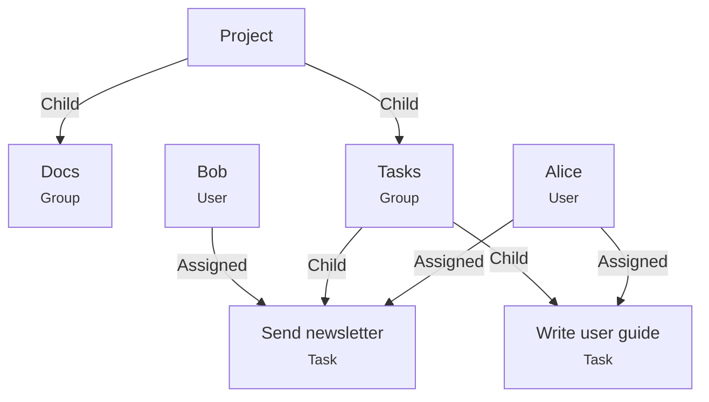
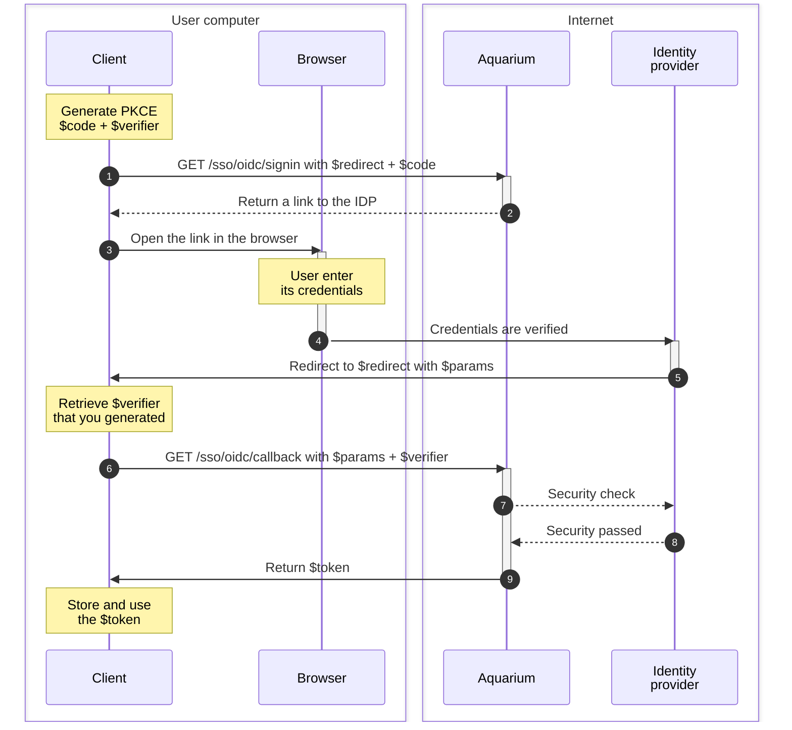

# Introduction to API

You can interact with Aquarium using our [REST API](../rest). There is no limitation using this API, the web interface is using exactly the same endpoints.

It's is completely abstract, their is no mention of Project, Shots, Tasks, etc. You interact with items and edges.

> If you want a more easy start, you should look at the [python module](./modules/python.md). We added project related functions, helping you get your shots, assigned tasks, ...

There are some endpoints dedicated to specific actions, like permissions, sso, administration, ...

## What's Aquarium's nodal ?

All the data in Aquarium is stored in a nodal way : items are connected to each other using edges. It's a way to represent a graph.

<!-- Create a mermaid graph with a project, connected to 2 folders (Docs, Tasks) with 2 tasks (Write user guide and Send newsletter) -->



> In this example, we have a project where 2 folders are stored. On folders contains 2 tasks, that are assigned to Bob and Alice.

### Data hierarchy

By default Aquarium is using `Child` edge type to define a parent-child relationship : the default hierarchy.

> You can imagine that like on a file system, where a folder can contain other folders or files. This "relationship" is represented by the `Child` edge.

You can create your own edge type to represent other relationships. Look at the dedicated items documentation, where we show some of the default structures used for each of them.

## Authentication

Most of the endpoints require authentication. You can ask for a token using:

- [Sign-in a user](../rest/users/signin)
- [Generate a personal access token](../rest/users/create%20personal%20access%20token)
- [Sign-in using SSO OIDC](../rest/sso/oidc/signin)

### SSO

SSO is the abbreviation of Single Sign-On. It's here to allow you users to use external credentials to log in on Aquarium. Like using their professional credentials instead of having to remember a new password.

Today, Aquarium is only compatible with OpenID Connect (OIDC) SSO.

Once OIDC is configured using the [dedicated API endpoint](../rest/sso/oidc/create) or using the [web interface in the Domain application](../web/applications/domain.md#sso), sign-in a user require a specific flow:

Every time you see an action in the `Client` column, it's something you need to do in your application.



#### What's PKCE ?

PKCE is the abbreviation of Proof Key for Code Exchange. It's a security feature to prevent code interception. It's a way to ensure that the code exchange is done by the same client that initiated the flow.

You need to generate a new PKCE for every sign-in request. You can find many example online, it's a simple process:

1. Generate what we call a `$verifier` in the sequence graph. It's a random string.
2. SHA256 hash the `$verifier` to get a `$code`.
3. Base64 URL encode the `$code`.

[details Using Javascript

```javascript
  function generateRandomString() {
    function dec2hex(dec) {
      return ('0' + dec.toString(16)).substr(-2)
    }

    const array = new Uint32Array(56/2);
    window.crypto.getRandomValues(array);
    return Array.from(array, dec2hex).join('');
  }

  // Generate a random string
  const verifier = generateRandomString();

  async function pkce_challenge_from_verifier(v) {
    function sha256(plain) {
      const encoder = new TextEncoder();
      const data = encoder.encode(plain);
      return window.crypto.subtle.digest('SHA-256', data);
    }

    function base64urlencode(a) {
      return btoa(String.fromCharCode.apply(null, new Uint8Array(a)))
        .replace(/\+/g, '-').replace(/\//g, '_').replace(/=+$/, '');
    }

    const hashed = await sha256(v);
    const base64encoded = base64urlencode(hashed);
    return base64encoded;
  }

  // Transform the verifier into a PKCE code
  const code = await pkce_challenge_from_verifier(verifier);
```

]
[details Using Python

```python
# -*- coding: utf-8 -*-
import os
import hashlib
import base64

# Generate a random string
verifier = os.urandom(32).hex()

# Transform the verifier into a PKCE code
verifierS256 = hashlib.sha256(self.verifier.encode('ascii')).digest()
code = base64.urlsafe_b64encode(verifierS256).decode('ascii').rstrip('=')
```
]

You can test your [PKCE generation output on this website](https://example-app.com/pkce).

The token need to be added as a Bearer token in the `Authorization` header.

## Endpoints

The API is separated in several endpoints, that [you can find in the dedicated section](../rest/):


- Bots
- Domain
- Edges
- Environments
- Events
- Items
- Jobs
- Multifactor authentication
- Organisations
- Permissions
- Sso
- Templates
- Trash
- Usergroups
- Users

## meshQL

Some endpoints use [meshQL](./meshql.md) to filter and navigate the data. It's also a way to customize the output of our API.