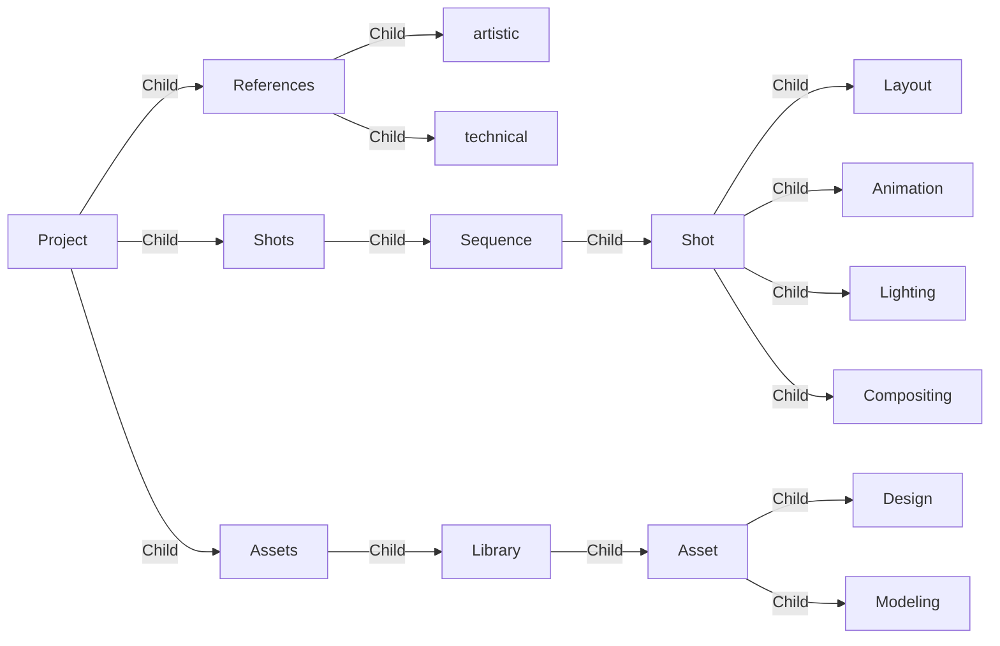
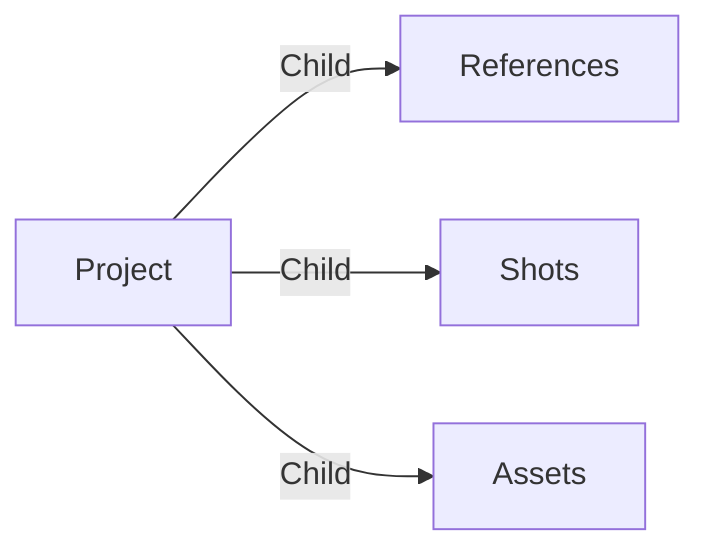
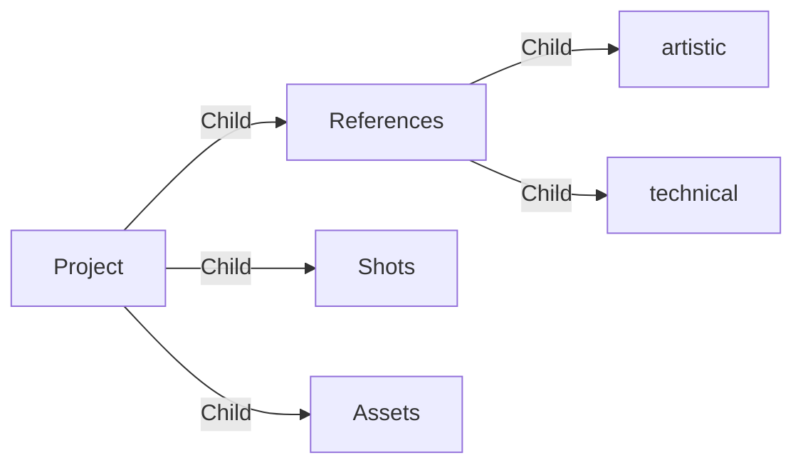

# What is meshQL?

MeshQL is a query language that allows you to interact with the graph data on
Aquarium.

For the rest of this page, let's assume this nodal structure:



# What's meshQL syntax?

The main meshQL query is written as a text string:

[#](#start) <small>+</small> [-()>](#fish) <small>+</small>
[[offset, limit]](#offset-limit) <small>+</small> [filter expression](#filter)
<small>+</small> [[SET set expression]](#set) <small>+</small>
[[UNIQUE]](#unique) <small>+</small> [[SORT sort expression]](#sort)
<small>+</small> [[VIEW view expression]](#view)

> All elements enclosed in square brackets are optional. The `+` is only here to
> improve readability. When you write a query, you should not include it.

## Start

meshQL always starts with a `#` at the beginning of the query.

## Fish

Because you are Aquarium, we added a fish in the query. Here is the syntax of
that element :

[direction `-(` or `<(`](#direction) <small>+</small> [[edge type]](#edge-type)
<small>+</small> [[, depth]](#depth) <small>+</small>
[direction `)-` or `)>`](#direction)

### Direction

The fish indicates the direction of the query. Because you are traversing a tree
of data, you can traverse in two directions:

- `-()>` to go from parent to child
- `<()-` to go from child to parent

You can also traverse in both directions by using a siamese fish `<()>`.

### Edge type

Inside the fish you can specify the edge type you want to traverse. For example,
if you want to traverse only `Child` edges, you can write `-($Child)>`.

### Depth

The depth is a number and it's used to indicate the number of levels you want to
traverse. For example, if you want to traverse 2 levels, you can write
`-($Child, 2)>`.

If you don't specify an edge type, you don't need to add the comma. For example,
if you want to traverse 2 levels without specifying the edge type, you can write
`-(2)>`.

If you don't specify the depth, a depth of 1 is assumed.

## Offset, Limit

If you want, you can specify the number of items you want to skip (`offset`) and
the number of items you want to get (`limit`). The syntax is:

`offset, limit`

Offset and limit are numbers. If you want to get the first 10 items, you can
write `# -()> 0,10 $Group`. If you want to get the next 10 items, you can write
`# -()> 10,10 $Group`, ...

The offset is used to create pagination. For example, if you want to get the 3rd
page of 10 items, you can write `# -()> 20,10 $Group`.

If you don't specify the offset/limit pair, a default offset of `0` and a
default limit of `50` are used. It means that if you write `# -()> $Group`, you
will get the first 50 Groups.

An offset/limit should always be used with a [SORT expression](#sort).

## Filter

The all goal of filtering data is to get only the data you are interested in.
That's why filters are important.

### Introduction to filter

Before diving into the syntax, you need more context on how your data is
traversed.

Let's assume this query: `# -($Child, 2)> item.type == 'Group'`, where I want to
get all items connected with a `Child` edge and the item type is `Group`. We
will use the Project as starting point.

The query will start from the Project, traversing one level of edges of type
`Child` searching for items of type `Group`.



Three groups are found: `References`, `Shots`, `Assets`

Because a depth of 2 is used, the query will traverse one more level of edges of
type `Child`.



Two more groups are found: `artistic`, `technical`

Three main information was obtained during the traversal:

- `item`: It's the item found during the traversal. In this case, it's each
  Group item.
- `edge`: It's the last edge traversed before finding the item. In this case,
  it's the `Child` edge of each Group.
- `path`: It's the path from the starting point to the item.
  - It's an object composed by 2 properties `vertices` and `edges`.
  - Both properties are arrays, respectively composed by the items and the edges
    traversed.
    - For the first Group `References`, the path is:
      > ```
      > {
      >  vertices: [Project, References],
      >  edges: [Child from Project to References]
      > }
      > ```
    - For the second Group `artistic`, the path is:
      > ```
      > {
      >  vertices: [Project, References, artistic],
      >  edges: [Child from Project to References, Child from References to artistic]
      > }
      > ```

### Filter syntax

Now that we know the properties available during a traversal, we can play with
them to filter the data.

So if you want to filter only items of type `Group`, you can write
`item.type == 'Group'`.

Filtering type is the most common filter. To make it easier to write, you can
directly use this notation instead: `$Group`.

If you want to filter based on another item property you can write :

| Filter                           | Description                          |
| :------------------------------- | :----------------------------------- |
| `item._key_ == '1234'`           | Get items with the key `1234`        |
| `item.data.name == 'references'` | Get items with the name `references` |
| `item.data.status == 'done'`     | Get items with the status `done`     |

Of course you can use `edge` filters as well:

| Filter                   | Description                                 |
| :----------------------- | :------------------------------------------ |
| `edge.type == 'Child'`   | Filter edge with type `Child`               |
| `edge.data.foo == 'bar'` | Filter edge with data `foo` equals to `bar` |

You can do the same with `path`:

| Filter                                       | Description                                                  |
| :------------------------------------------- | :----------------------------------------------------------- |
| `path.vertices.length == 2`                  | Filter path with 2 vertices                                  |
| `path.vertices[-2].data.name == 'reference'` | Filter path where the parent item name equals to `reference` |

When you write `-($Child)>` it's in fact a shortcut for
`-()> path.edges[*].type ALL IN 'Child'`.

It's time to introduce 2 new notions : `path.edges[*]` and `ALL IN`.

The notation `ARRAY[*].property` allows you to access the `property` of all
elements of the array. In the previous example, it's used to access the `type`
of all edges of the path.

The `ALL IN` is a special operator used with arrays.

### Operators

To compare values, you can use the following operators:

| Operator | Description                                                 |
| -------- | ----------------------------------------------------------- |
| ==       | equality                                                    |
| !=       | inequality                                                  |
| <        | less than                                                   |
| <=       | less or equal                                               |
| >        | greater than                                                |
| >=       | greater or equal                                            |
| IN       | test if a value is contained in an array                    |
| NOT IN   | test if a value is not contained in an array                |
| LIKE     | tests if a string value matches a pattern                   |
| NOT LIKE | tests if a string value does not match a pattern            |
| =~       | tests if a string value matches a regular expression        |
| !~       | tests if a string value does not match a regular expression |

---

Once you understand the syntax, you can read the query as a sentence.

| meshQL                              | Description                                                                |
| :---------------------------------- | :------------------------------------------------------------------------- |
| `# -($Child)> item.type == 'Group'` | Get items connected with an edge type `Child` and the item type is `Group` |

Their is 2 main ways of exploring and filtering data on Aquarium:

| Endpoint  | Description                                                       | Example                                                                                                              |
| :-------- | :---------------------------------------------------------------- | :------------------------------------------------------------------------------------------------------------------- |
| /traverse | Traverse the tree of data from a starting point                   | `# -($Child)> item.type == 'Group'` <br/> Get items connected with an edge type `Child` and the item type is `Group` |
| /query    | Query data without starting point. It's more like a global search | `# item.type == 'Project'` <br/> Get all items of type `Project`                                                     |
