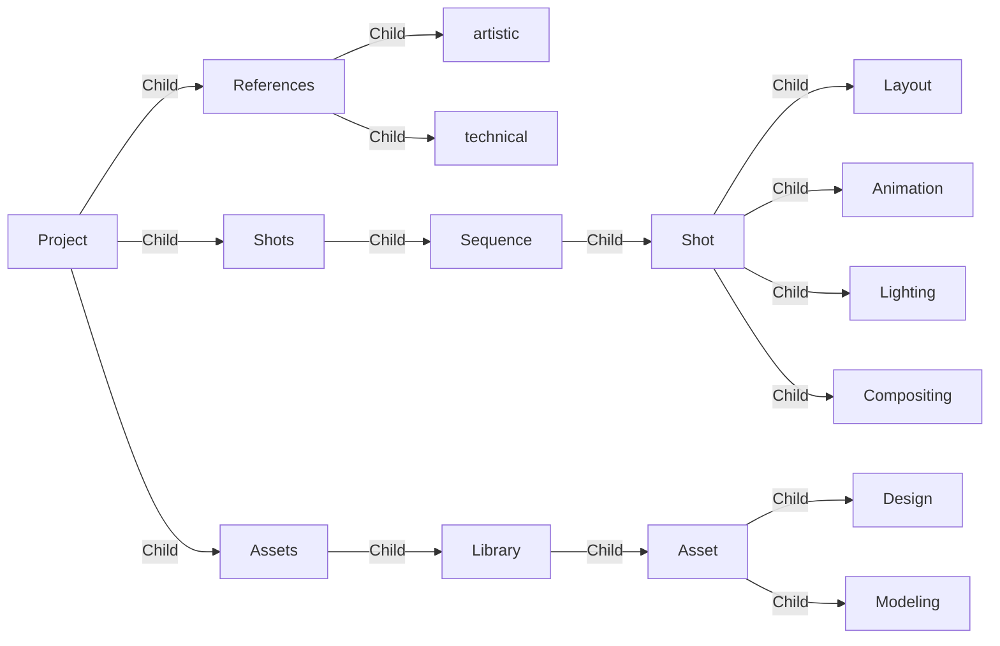
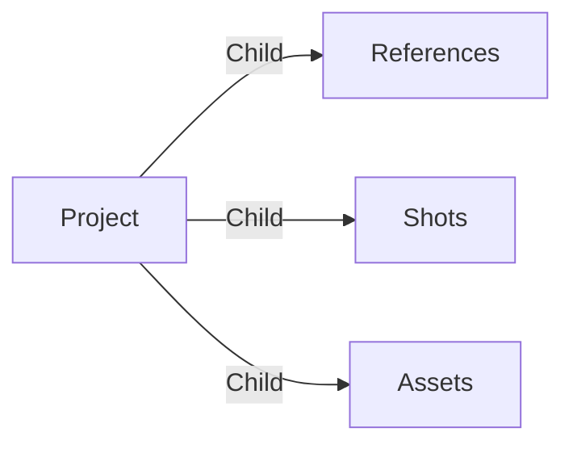
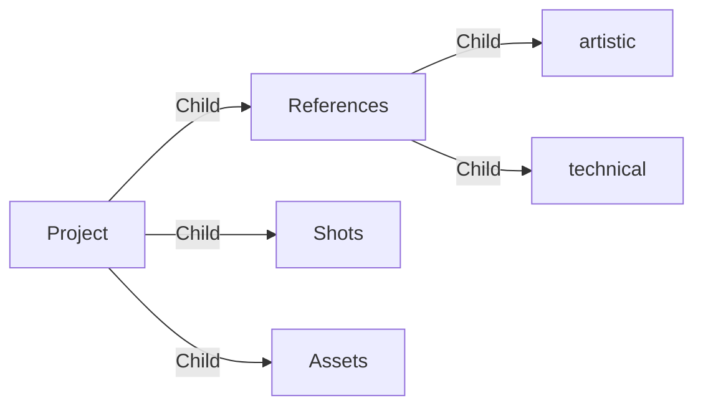
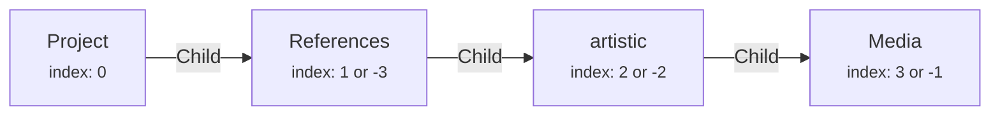
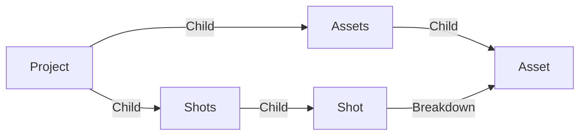

# What is meshQL?

MeshQL is a query language that allows you to interact with the graph data on Aquarium.

It's a transpiler that converts a meshQL query into an ArangoDB query language (AQL). It was develop to make it easier for developers to interact with the graph data. And also more secure, preventing injections and handling permissions.

Once you understand the syntax, you will be able to read the query as a sentence.

For the rest of this page, let's assume this nodal structure:




There are 2 main ways of exploring and filtering a graph on Aquarium:

| Method  | Description                                                       | Example                                                                                                              |
| :-------- | :---------------------------------------------------------------- | :------------------------------------------------------------------------------------------------------------------- |
| traverse | Traverse the tree of data from a starting point                   | `# -($Child)> item.type == 'Group'` <br/> Get items connected with an edge type `Child` and the item type is `Group` |
| query    | Query data without starting point. It's more like a global search | `# item.type == 'Project'` <br/> Get all items of type `Project`                                                     |


# What's its syntax?

The main meshQL query is written as a text string:

[#](#start) <small>+</small> [-()>](#fish) <small>+</small> [[offset, limit]](#offset-limit) <small>+</small> [filter expression](#filter) <small>+</small> [[SET set expression]](#set) <small>+</small> [[UNIQUE]](#unique) <small>+</small> [[SORT sort expression]](#sort) <small>+</small> [[VIEW view expression]](#view)

> All elements enclosed in square brackets are optional. The `+` is only here to
> improve readability. When you write a query, you should not include it.

## Start

meshQL always starts with a `#` at the beginning of the query.

## Fish

Because you are Aquarium, we added a fish in the query. Here is the syntax of that element :

[direction `-(` or `<(`](#direction) <small>+</small> [[edge type]](#edge-type) <small>+</small> [[, depth]](#depth) <small>+</small> [direction `)-` or `)>`](#direction)

### Direction

The fish indicates the direction of the query. Because you are traversing a tree of data, you can traverse in two directions:

- `-()>` to go from parent to child
- `<()-` to go from child to parent

You can also traverse in both directions by using a siamese fish `<()>`.

### Edge type

Inside the fish you can specify the edge type you want to traverse. For example, if you want to traverse only `Child` edges, you can write `-($Child)>`.

### Depth

The depth is a number and it's used to indicate the number of levels you want to traverse. For example, if you want to traverse 2 levels, you can write `-($Child, 2)>`.

If you don't specify an edge type, you don't need to add the comma. For example, if you want to traverse 2 levels without specifying the edge type, you can write `-(2)>`.

If you don't specify the depth, a depth of 1 is assumed.

## Offset, Limit

If you want, you can specify the number of items you want to skip (`offset`) and the number of items you want to get (`limit`). The syntax is:

`offset, limit`

Offset and limit are numbers. If you want to get the first 10 items, you can write `# -()> 0,10 $Group`. If you want to get the next 10 items, you can write `# -()> 10,10 $Group`, ...

The offset is used to create pagination. For example, if you want to get the 3rd page of 10 items, you can write `# -()> 20,10 $Group`.

If you don't specify the offset/limit pair, a default offset of `0` and a default limit of `50` are used. It means that if you write `# -()> $Group`, you will get the first 50 Groups.

An offset/limit should always be used with a [SORT expression](#sort).

## Filter

The all goal of filtering data is to get only the data you are interested in. That's why filters are important.

### Introduction to filter

Before diving into the syntax, you need more context on how your data is traversed.

Let's assume this query: `# -($Child, 2)> item.type == 'Group'`, where I want to get all items connected with a `Child` edge and the item type is `Group`. We will use the Project as starting point.

The query will start from the Project, traversing one level of edges of type `Child` searching for items of type `Group`.



Three groups are found: `References`, `Shots`, `Assets`

Because a depth of 2 is used, the query will traverse one more level of edges of type `Child`.



Two more groups are found: `artistic`, `technical`

Three main information was obtained during the traversal:

- `item`: It's the item found during the traversal. In this case, it's each
  Group item.
- `edge`: It's the last edge traversed before finding the item. In this case,
  it's the `Child` edge of each Group.
- `path`: It's the path from the starting point to the item.
  - It's an object composed by 2 properties `vertices` and `edges`.
  - Both properties are arrays, respectively composed by the `items` and the `edges` traversed.
    - For the first Group `References`, the path is:
      > ```
      > {
      >  vertices: [Project, References],
      >  edges: [Child from Project to References]
      > }
      > ```
    - For the second Group `artistic`, the path is:
      > ```
      > {
      >  vertices: [Project, References, artistic],
      >  edges: [Child from Project to References, Child from References to artistic]
      > }
      > ```

### Filter syntax

Now that we know the properties available during a traversal, we can play with them to filter the data.

So if you want to filter only items of type `Group`, you can write `item.type == 'Group'`.

Filtering type is the most common filter. To make it easier to write, you can directly use this notation instead: `$Group`.

If you want to filter based on another item property you can write :

| Filter                           | Description                          |
| :------------------------------- | :----------------------------------- |
| `item._key == '1234'`            | Get items with the key `1234`        |
| `item.data.name == 'references'` | Get items with the name `references` |
| `item.data.status == 'done'`     | Get items with the status `done`     |

Of course you can use `edge` filters as well:

| Filter                   | Description                                 |
| :----------------------- | :------------------------------------------ |
| `edge.type == 'Child'`   | Filter edge with type `Child`               |
| `edge.data.foo == 'bar'` | Filter edge with data `foo` equals to `bar` |

You can do the same with `path`:

| Filter                                       | Description                                                  |
| :------------------------------------------- | :----------------------------------------------------------- |
| `path.vertices.length == 2`                  | Filter path with 2 vertices                                  |
| `path.vertices[-2].data.name == 'reference'` | Filter path where the parent item name equals to `reference` |

When you write `-($Child)>` it's in fact a shortcut for `-()> path.edges[*].type ALL IN 'Child'`.

It's time to introduce 2 new notions : `path.edges[*]` and `ALL IN`.

The [notation `ARRAY[*].property`](#array-expansion) allows you to access the `property` of all elements of the array. In the previous example, it's used to access the `type` of all edges of the path.

The `ALL IN` is a special operator used with arrays.

### Operators

#### Comparison operators
To compare values, you can use the following operators:

| Operator | Description                                                 |
| -------- | ----------------------------------------------------------- |
| ==       | equality                                                    |
| !=       | inequality                                                  |
| <        | less than                                                   |
| <=       | less or equal                                               |
| >        | greater than                                                |
| >=       | greater or equal                                            |
| IN       | test if a value is contained in an array                    |
| NOT IN   | test if a value is not contained in an array                |
| LIKE     | tests if a string value matches a pattern                   |
| NOT LIKE | tests if a string value does not match a pattern            |
| =~       | tests if a string value matches a regular expression        |
| !~       | tests if a string value does not match a regular expression |

#### Array comparison operators

There is also dedicated operators for arrays:

| Operator | Description                                      |
|----------|--------------------------------------------------|
| ALL IN  *ARRAY* | test if all values are contained in an array     |
| NONE IN  *ARRAY* | test if no values are contained in an array      |
| ANY IN  *ARRAY* | test if any value is contained in an array       |
| ANY ==  *VALUE* | test if any value equals a specified value       |
| ANY >  *VALUE* | test if any value is greater than a specified value |
| ANY <=  *VALUE* | test if any value is less than or equal to a specified value |
| NONE >  *VALUE* | test if no value is greater than a specified value |
| ALL >  *VALUE* | test if all values are greater than a specified value |

#### Logical operators

You can combine multiple conditions using logical operators:

- `AND`
- `OR`
- `NOT`

### Array expansion

To access all property named `foo` on all element of an `ARRAY`, you can use the the notation `ARRAY[*].foo`.

> Example:
> On a path, if you want to get the names of all vertices, you can write `path.vertices[*].data.name`. This will return an array of all names.

### Inline expression

You can also filter an array, using this notation:

ARRAY[* FILTER [filter expression](#filter-syntax)]

In this inline filter, use the special variable `CURRENT` to refer to the current element of the array.

> Example:
> Let's say you want to filter all vertices where the data.important is true. You can write `path.vertices[* FILTER CURRENT.data.important == true]`.

### Array indexes

You can of course select an element of an array using an index. The index is 0-based.

So in order to get the first element of an array, you can write `ARRAY[0]`. The second element will be `ARRAY[1]`, ...

But you can also use negative indexes. In this case, the index is relative to the end of the array. So to get the last element of an array, you can write `ARRAY[-1]`. The second to last element will be `ARRAY[-2]`, ...

It's a useful tool to select element in `path.vertices` or `path.edges`, using relative indexes.


### Functions

Functions are also available to help you filter and manipulate data. Functions are based on [ArangoDB functions](https://docs.arangodb.com/3.11/aql/functions/).

> [!note]
> If a function is not allowed or you think it's missing, [contact us](../contact.md).

Here is a list of available functions:

[details <span class="aq-icon">data_array</span> Array functions

- [APPEND()](https://docs.arangodb.com/3.11/aql/functions/array/#append)
- [CONTAINS_ARRAY()](https://docs.arangodb.com/3.11/aql/functions/array/#contains_array)
- [COUNT()](https://docs.arangodb.com/3.11/aql/functions/array/#count)
- [COUNT_DISTINCT()](https://docs.arangodb.com/3.11/aql/functions/array/#count_distinct)
- [COUNT_UNIQUE()](https://docs.arangodb.com/3.11/aql/functions/array/#count_unique)
- [FIRST()](https://docs.arangodb.com/3.11/aql/functions/array/#first)
- [FLATTEN()](https://docs.arangodb.com/3.11/aql/functions/array/#flatten)
- [INTERLEAVE()](https://docs.arangodb.com/3.11/aql/functions/array/#interleave)
- [INTERSECTION()](https://docs.arangodb.com/3.11/aql/functions/array/#intersection)
- [JACCARD()](https://docs.arangodb.com/3.11/aql/functions/array/#jaccard)
- [LAST()](https://docs.arangodb.com/3.11/aql/functions/array/#last)
- [LENGTH()](https://docs.arangodb.com/3.11/aql/functions/array/#length)
- [MINUS()](https://docs.arangodb.com/3.11/aql/functions/array/#minus)
- [NTH()](https://docs.arangodb.com/3.11/aql/functions/array/#nth)
- [OUTERSECTION()](https://docs.arangodb.com/3.11/aql/functions/array/#outersection)
- [POP()](https://docs.arangodb.com/3.11/aql/functions/array/#pop)
- [POSITION()](https://docs.arangodb.com/3.11/aql/functions/array/#position)
- [PUSH()](https://docs.arangodb.com/3.11/aql/functions/array/#push)
- [REMOVE_NTH()](https://docs.arangodb.com/3.11/aql/functions/array/#remove_nth)
- [REPLACE_NTH()](https://docs.arangodb.com/3.11/aql/functions/array/#replace_nth)
- [REMOVE_VALUE()](https://docs.arangodb.com/3.11/aql/functions/array/#remove_value)
- [REMOVE_VALUES()](https://docs.arangodb.com/3.11/aql/functions/array/#remove_values)
- [REVERSE()](https://docs.arangodb.com/3.11/aql/functions/array/#reverse)
- [SHIFT()](https://docs.arangodb.com/3.11/aql/functions/array/#shift)
- [SLICE()](https://docs.arangodb.com/3.11/aql/functions/array/#slice)
- [SORTED()](https://docs.arangodb.com/3.11/aql/functions/array/#sorted)
- [SORTED_UNIQUE()](https://docs.arangodb.com/3.11/aql/functions/array/#sorted_unique)
- [UNION()](https://docs.arangodb.com/3.11/aql/functions/array/#union)
- [UNION_DISTINCT()](https://docs.arangodb.com/3.11/aql/functions/array/#union_distinct)
- [UNIQUE()](https://docs.arangodb.com/3.11/aql/functions/array/#unique)
- [UNSHIFT()](https://docs.arangodb.com/3.11/aql/functions/array/#unshift)

]

[details <span class="aq-icon">event</span> Date functions

- [DATE_NOW()](https://docs.arangodb.com/3.11/aql/functions/date/#date_now)
- [DATE_ISO8601()](https://docs.arangodb.com/3.11/aql/functions/date/#date_iso8601)
- [DATE_TIMESTAMP()](https://docs.arangodb.com/3.11/aql/functions/date/#date_timestamp)
- [IS_DATESTRING()](https://docs.arangodb.com/3.11/aql/functions/date/#is_datestring)
- [DATE_DAYOFWEEK()](https://docs.arangodb.com/3.11/aql/functions/date/#date_dayofweek)
- [DATE_YEAR()](https://docs.arangodb.com/3.11/aql/functions/date/#date_year)
- [DATE_MONTH()](https://docs.arangodb.com/3.11/aql/functions/date/#date_month)
- [DATE_DAY()](https://docs.arangodb.com/3.11/aql/functions/date/#date_day)
- [DATE_HOUR()](https://docs.arangodb.com/3.11/aql/functions/date/#date_hour)
- [DATE_MINUTE()](https://docs.arangodb.com/3.11/aql/functions/date/#date_minute)
- [DATE_SECOND()](https://docs.arangodb.com/3.11/aql/functions/date/#date_second)
- [DATE_MILLISECOND()](https://docs.arangodb.com/3.11/aql/functions/date/#date_millisecond)
- [DATE_DAYOFYEAR()](https://docs.arangodb.com/3.11/aql/functions/date/#date_dayofyear)
- [DATE_ISOWEEK()](https://docs.arangodb.com/3.11/aql/functions/date/#date_isoweek)
- [DATE_ISOWEEKYEAR()](https://docs.arangodb.com/3.11/aql/functions/date/#date_isoweekyear)
- [DATE_LEAPYEAR()](https://docs.arangodb.com/3.11/aql/functions/date/#date_leapyear)
- [DATE_QUARTER()](https://docs.arangodb.com/3.11/aql/functions/date/#date_quarter)
- [DATE_DAYS_IN_MONTH()](https://docs.arangodb.com/3.11/aql/functions/date/#date_days_in_month)
- [DATE_TRUNC()](https://docs.arangodb.com/3.11/aql/functions/date/#date_trunc)
- [DATE_ROUND()](https://docs.arangodb.com/3.11/aql/functions/date/#date_round)
- [DATE_FORMAT()](https://docs.arangodb.com/3.11/aql/functions/date/#date_format)
- [DATE_ADD()](https://docs.arangodb.com/3.11/aql/functions/date/#date_add)
- [DATE_SUBTRACT()](https://docs.arangodb.com/3.11/aql/functions/date/#date_subtract)
- [DATE_DIFF()](https://docs.arangodb.com/3.11/aql/functions/date/#date_diff)
- [DATE_COMPARE()](https://docs.arangodb.com/3.11/aql/functions/date/#date_compare)
- [DATE_UTCTOLOCAL()](https://docs.arangodb.com/3.11/aql/functions/date/#date_utctolocal)
- [DATE_LOCALTOUTC()](https://docs.arangodb.com/3.11/aql/functions/date/#date_localtoutc)
- [DATE_TIMEZONE()](https://docs.arangodb.com/3.11/aql/functions/date/#date_timezone)
- [DATE_TIMEZONES()](https://docs.arangodb.com/3.11/aql/functions/date/#date_timezones)
-
]

[details <span class="aq-icon">data_object</span> Object functions

- [ATTRIBUTES()](https://docs.arangodb.com/3.11/aql/functions/document-object/#attributes)
- [COUNT()](https://docs.arangodb.com/3.11/aql/functions/document-object/#count)
- [HAS()](https://docs.arangodb.com/3.11/aql/functions/document-object/#has)
- [IS_SAME_COLLECTION()](https://docs.arangodb.com/3.11/aql/functions/document-object/#is_same_collection)
- [KEEP()](https://docs.arangodb.com/3.11/aql/functions/document-object/#keep)
- [KEEP_RECURSIVE()](https://docs.arangodb.com/3.11/aql/functions/document-object/#keep_recursive)
- [KEYS()](https://docs.arangodb.com/3.11/aql/functions/document-object/#keys)
- [LENGTH()](https://docs.arangodb.com/3.11/aql/functions/document-object/#length)
- [MATCHES()](https://docs.arangodb.com/3.11/aql/functions/document-object/#matches)
- [MERGE()](https://docs.arangodb.com/3.11/aql/functions/document-object/#merge)
- [MERGE_RECURSIVE()](https://docs.arangodb.com/3.11/aql/functions/document-object/#merge_recursive)
- [PARSE_IDENTIFIER()](https://docs.arangodb.com/3.11/aql/functions/document-object/#parse_identifier)
- [TRANSLATE()](https://docs.arangodb.com/3.11/aql/functions/document-object/#translate)
- [UNSET()](https://docs.arangodb.com/3.11/aql/functions/document-object/#unset)
- [UNSET_RECURSIVE()](https://docs.arangodb.com/3.11/aql/functions/document-object/#unset_recursive)
- [VALUE()](https://docs.arangodb.com/3.11/aql/functions/document-object/#value)
- [VALUES()](https://docs.arangodb.com/3.11/aql/functions/document-object/#values)
- [ZIP()](https://docs.arangodb.com/3.11/aql/functions/document-object/#zip)
]

[details <span class="aq-icon">123</span> Numeric functions

- [ABS()](https://docs.arangodb.com/3.11/aql/functions/numeric/#abs)
- [ACOS()](https://docs.arangodb.com/3.11/aql/functions/numeric/#acos)
- [ASIN()](https://docs.arangodb.com/3.11/aql/functions/numeric/#asin)
- [ATAN()](https://docs.arangodb.com/3.11/aql/functions/numeric/#atan)
- [ATAN2()](https://docs.arangodb.com/3.11/aql/functions/numeric/#atan2)
- [AVERAGE()](https://docs.arangodb.com/3.11/aql/functions/numeric/#average)
- [AVG()](https://docs.arangodb.com/3.11/aql/functions/numeric/#avg)
- [CEIL()](https://docs.arangodb.com/3.11/aql/functions/numeric/#ceil)
- [COS()](https://docs.arangodb.com/3.11/aql/functions/numeric/#cos)
- [COSINE_SIMILARITY()](https://docs.arangodb.com/3.11/aql/functions/numeric/#cosine_similarity)
- [DECAY_GAUSS()](https://docs.arangodb.com/3.11/aql/functions/numeric/#decay_gauss)
- [DECAY_EXP()](https://docs.arangodb.com/3.11/aql/functions/numeric/#decay_exp)
- [DECAY_LINEAR()](https://docs.arangodb.com/3.11/aql/functions/numeric/#decay_linear)
- [DEGREES()](https://docs.arangodb.com/3.11/aql/functions/numeric/#degrees)
- [EXP()](https://docs.arangodb.com/3.11/aql/functions/numeric/#exp)
- [EXP2()](https://docs.arangodb.com/3.11/aql/functions/numeric/#exp2)
- [FLOOR()](https://docs.arangodb.com/3.11/aql/functions/numeric/#floor)
- [LOG()](https://docs.arangodb.com/3.11/aql/functions/numeric/#log)
- [LOG2()](https://docs.arangodb.com/3.11/aql/functions/numeric/#log2)
- [LOG10()](https://docs.arangodb.com/3.11/aql/functions/numeric/#log10)
- [L1_DISTANCE()](https://docs.arangodb.com/3.11/aql/functions/numeric/#l1_distance)
- [L2_DISTANCE()](https://docs.arangodb.com/3.11/aql/functions/numeric/#l2_distance)
- [MAX()](https://docs.arangodb.com/3.11/aql/functions/numeric/#max)
- [MEDIAN()](https://docs.arangodb.com/3.11/aql/functions/numeric/#median)
- [MIN()](https://docs.arangodb.com/3.11/aql/functions/numeric/#min)
- [PERCENTILE()](https://docs.arangodb.com/3.11/aql/functions/numeric/#percentile)
- [PI()](https://docs.arangodb.com/3.11/aql/functions/numeric/#pi)
- [POW()](https://docs.arangodb.com/3.11/aql/functions/numeric/#pow)
- [PRODUCT()](https://docs.arangodb.com/3.11/aql/functions/numeric/#product)
- [RADIANS()](https://docs.arangodb.com/3.11/aql/functions/numeric/#radians)
- [RAND()](https://docs.arangodb.com/3.11/aql/functions/numeric/#rand)
- [RANGE()](https://docs.arangodb.com/3.11/aql/functions/numeric/#range)
- [ROUND()](https://docs.arangodb.com/3.11/aql/functions/numeric/#round)
- [SIN()](https://docs.arangodb.com/3.11/aql/functions/numeric/#sin)
- [SQRT()](https://docs.arangodb.com/3.11/aql/functions/numeric/#sqrt)
- [STDDEV_POPULATION()](https://docs.arangodb.com/3.11/aql/functions/numeric/#stddev_population)
- [STDDEV_SAMPLE()](https://docs.arangodb.com/3.11/aql/functions/numeric/#stddev_sample)
- [STDDEV()](https://docs.arangodb.com/3.11/aql/functions/numeric/#stddev)
- [SUM()](https://docs.arangodb.com/3.11/aql/functions/numeric/#sum)
- [TAN()](https://docs.arangodb.com/3.11/aql/functions/numeric/#tan)
- [VARIANCE_POPULATION()](https://docs.arangodb.com/3.11/aql/functions/numeric/#variance_population)
- [VARIANCE_SAMPLE()](https://docs.arangodb.com/3.11/aql/functions/numeric/#variance_sample)
- [VARIANCE()](https://docs.arangodb.com/3.11/aql/functions/numeric/#variance)

]

[details <span class="aq-icon">text_fields</span> String functions

- [CHAR_LENGTH()](https://docs.arangodb.com/3.11/aql/functions/string/#char_length)
- [CONCAT()](https://docs.arangodb.com/3.11/aql/functions/string/#concat)
- [CONCAT_SEPARATOR()](https://docs.arangodb.com/3.11/aql/functions/string/#concat_separator)
- [CONTAINS()](https://docs.arangodb.com/3.11/aql/functions/string/#contains)
- [COUNT()](https://docs.arangodb.com/3.11/aql/functions/string/#count)
- [CRC32()](https://docs.arangodb.com/3.11/aql/functions/string/#crc32)
- [ENCODE_URI_COMPONENT()](https://docs.arangodb.com/3.11/aql/functions/string/#encode_uri_component)
- [FIND_FIRST()](https://docs.arangodb.com/3.11/aql/functions/string/#find_first)
- [FIND_LAST()](https://docs.arangodb.com/3.11/aql/functions/string/#find_last)
- [FNV64()](https://docs.arangodb.com/3.11/aql/functions/string/#fnv64)
- [IPV4_FROM_NUMBER()](https://docs.arangodb.com/3.11/aql/functions/string/#ipv4_from_number)
- [IPV4_TO_NUMBER()](https://docs.arangodb.com/3.11/aql/functions/string/#ipv4_to_number)
- [IS_IPV4()](https://docs.arangodb.com/3.11/aql/functions/string/#is_ipv4)
- [JSON_PARSE()](https://docs.arangodb.com/3.11/aql/functions/string/#json_parse)
- [JSON_STRINGIFY()](https://docs.arangodb.com/3.11/aql/functions/string/#json_stringify)
- [LEFT()](https://docs.arangodb.com/3.11/aql/functions/string/#left)
- [LENGTH()](https://docs.arangodb.com/3.11/aql/functions/string/#length)
- [LEVENSHTEIN_DISTANCE()](https://docs.arangodb.com/3.11/aql/functions/string/#levenshtein_distance)
- [LIKE()](https://docs.arangodb.com/3.11/aql/functions/string/#like)
- [LOWER()](https://docs.arangodb.com/3.11/aql/functions/string/#lower)
- [LTRIM()](https://docs.arangodb.com/3.11/aql/functions/string/#ltrim)
- [MD5()](https://docs.arangodb.com/3.11/aql/functions/string/#md5)
- [NGRAM_POSITIONAL_SIMILARITY()](https://docs.arangodb.com/3.11/aql/functions/string/#ngram_positional_similarity)
- [NGRAM_SIMILARITY()](https://docs.arangodb.com/3.11/aql/functions/string/#ngram_similarity)
- [RANDOM_TOKEN()](https://docs.arangodb.com/3.11/aql/functions/string/#random_token)
- [REGEX_MATCHES()](https://docs.arangodb.com/3.11/aql/functions/string/#regex_matches)
- [REGEX_SPLIT()](https://docs.arangodb.com/3.11/aql/functions/string/#regex_split)
- [REGEX_TEST()](https://docs.arangodb.com/3.11/aql/functions/string/#regex_test)
- [REGEX_REPLACE()](https://docs.arangodb.com/3.11/aql/functions/string/#regex_replace)
- [REVERSE()](https://docs.arangodb.com/3.11/aql/functions/string/#reverse)
- [RIGHT()](https://docs.arangodb.com/3.11/aql/functions/string/#right)
- [RTRIM()](https://docs.arangodb.com/3.11/aql/functions/string/#rtrim)
- [SHA1()](https://docs.arangodb.com/3.11/aql/functions/string/#sha1)
- [SHA256()](https://docs.arangodb.com/3.11/aql/functions/string/#sha256)
- [SHA512()](https://docs.arangodb.com/3.11/aql/functions/string/#sha512)
- [SOUNDEX()](https://docs.arangodb.com/3.11/aql/functions/string/#soundex)
- [SPLIT()](https://docs.arangodb.com/3.11/aql/functions/string/#split)
- [STARTS_WITH()](https://docs.arangodb.com/3.11/aql/functions/string/#starts_with)
- [SUBSTITUTE()](https://docs.arangodb.com/3.11/aql/functions/string/#substitute)
- [SUBSTRING()](https://docs.arangodb.com/3.11/aql/functions/string/#substring)
- [SUBSTRING_BYTES()](https://docs.arangodb.com/3.11/aql/functions/string/#substring_bytes)
- [TOKENS()](https://docs.arangodb.com/3.11/aql/functions/string/#tokens)
- [TO_BASE64()](https://docs.arangodb.com/3.11/aql/functions/string/#to_base64)
- [TO_HEX()](https://docs.arangodb.com/3.11/aql/functions/string/#to_hex)
- [TRIM()](https://docs.arangodb.com/3.11/aql/functions/string/#trim)
- [UPPER()](https://docs.arangodb.com/3.11/aql/functions/string/#upper)
- [UUID()](https://docs.arangodb.com/3.11/aql/functions/string/#uuid)
]

[details <span class="aq-icon">category</span> Type check & cast functions

- [TO_BOOL()](https://docs.arangodb.com/3.11/aql/functions/type-check-and-cast/#to_bool)
- [TO_NUMBER()](https://docs.arangodb.com/3.11/aql/functions/type-check-and-cast/#to_number)
- [TO_STRING()](https://docs.arangodb.com/3.11/aql/functions/type-check-and-cast/#to_string)
- [TO_ARRAY()](https://docs.arangodb.com/3.11/aql/functions/type-check-and-cast/#to_array)
- [TO_LIST()](https://docs.arangodb.com/3.11/aql/functions/type-check-and-cast/#to_list)
- [IS_NULL()](https://docs.arangodb.com/3.11/aql/functions/type-check-and-cast/#is_null)
- [IS_BOOL()](https://docs.arangodb.com/3.11/aql/functions/type-check-and-cast/#is_bool)
- [IS_NUMBER()](https://docs.arangodb.com/3.11/aql/functions/type-check-and-cast/#is_number)
- [IS_STRING()](https://docs.arangodb.com/3.11/aql/functions/type-check-and-cast/#is_string)
- [IS_ARRAY()](https://docs.arangodb.com/3.11/aql/functions/type-check-and-cast/#is_array)
- [IS_LIST()](https://docs.arangodb.com/3.11/aql/functions/type-check-and-cast/#is_list)
- [IS_OBJECT()](https://docs.arangodb.com/3.11/aql/functions/type-check-and-cast/#is_object)
- [IS_DOCUMENT()](https://docs.arangodb.com/3.11/aql/functions/type-check-and-cast/#is_document)
- [IS_DATESTRING()](https://docs.arangodb.com/3.11/aql/functions/type-check-and-cast/#is_datestring)
- [IS_IPV4()](https://docs.arangodb.com/3.11/aql/functions/type-check-and-cast/#is_ipv4)
- [IS_KEY()](https://docs.arangodb.com/3.11/aql/functions/type-check-and-cast/#is_key)
- [TYPENAME()](https://docs.arangodb.com/3.11/aql/functions/type-check-and-cast/#typename)
]

[details <span class="aq-icon">note_stack</span> Miscellaneous functions

- IF(`condition`, `if true`, `if false`)
  - Example: `IF(item.data.status == 'DONE', 'Done', 'Not done')`

]

### Sub-filters

meshQL allows you filter items based on sub-filters. It's like a sub-query in a query.

For that you can write a new meshQL expression without the `#` at its beginning.

> Example: Filter shots where there is a Task named Layout:
>  `# -($Child, 5)> $Shot AND -($Child)> $Task AND item.data.name == 'Layout'`

The best is to enclose the sub-filter in parentheses to avoid any ambiguity.

> Example: `# -($Child, 5)> $Shot AND (-($Child)> $Task AND item.data.name == 'Layout')`

### Itinerary

You can define an itinerary to traverse your tree of data. It's like a sub-filter but without the operator.

> Example: Get the tasks where the parent is a shot:
> `# -($Child)> $Shot -($Child)> $Task`

It is more performant to write an itinerary than having a big depth.

You can use a SET, to store some data from the first itinerary section.

> Example:
> ```javascript
> const query = '# -($Child)> $Shot SET $set -($Child)> $Task VIEW $view'
> const aliases = {
>   "set": {
>     "shotName": "item.data.name"
>   },
>   "view": {
>     "taskName": "item.data.name",
>     "shotName": "shotName"
>   }
> }

## SET

Sometime you need to store a result in a variable to use it later in the query. That's why you can use the `SET` expression.

A `SET` expression is an object allow you to store the variable name as the key and its value as the value.

> Example:
> ```json
> SET {
>  "name": "item.data.name",
>  "status": "item.data.status"
> }
> ```

You call the SET variable in a meshQL expression calling only the name of the variable.

> Example:
> `# -($Child)> $Group AND item.data.name == ref SET { "ref": "references" }`

Instead of writing the SET object directly in the query, you can also use an [alias](#aliases) to store it.

> Example:
> ```javascript
> const query = '# -($Child)> $Group SET $set'
> const aliases = {
>   "set": {
>     "name": "item.data.name",
>     "status": "item.data.status"
>   }
> }

## UNIQUE

The `UNIQUE` is a keyword used to remove duplicates from the result. Because Aquarium is capable of creating cyclic graphs or having multiple edges type to the same, you can get the same item multiple times.

Let's imagine a project with assets and shots. Shots are connected to assets using a `Breakdown` edge.:



Let's use the Project as starting point and use this query: `# -(4)> $Asset`. Without the `UNIQUE` keyword, you will have 2 times the same asset, because the traversal used 2 different paths to reach the asset. One from the `Assets` folder, and the other from the `Shot` breakdown edge.

Using the `UNIQUE` keyword will remove the duplicates and you will have only one asset : `# -(4)> $Asset UNIQUE`.

## SORT

The `SORT` expression is used to sort the result. It's a string, composed as:

`SORT property [ASC|DESC]`

The sort direction is optional. If you don't specify it, the default direction is `ASC`.

You can combine multiple sort expressions by separating them with a comma :

`SORT property1 ASC, property2 DESC`

You can also disable the sort by writing `SORT null`. Disabling sort is a great performance improvement when you don't need to sort the result.

Unless you specify a sort expression or disable it, the default sort is by `item.data.name` in ascending order.

Keep in mind that you should't disable the sort if you use an [offset/limit](#offset-limit) pair. If you do so, the result will be unpredictable.

### Sorting items by their depth

The "depth" information is not a property of items or edges. It's an information gathered during the traversal and stored in the `path` variable.

You can use the number of vertices (items) in the path to sort the result: `SORT LENGTH(path.vertices) ASC`.

## VIEW

The `VIEW` expression is used to format the result. The `VIEW` is an object or a string.

The default view that is used is:

```json
{
  "item": "item",
  "edge": "edge"
}
```

You can override the default view by specifying the properties you want to see in the result.

> Example to only get the name of the items:
> ```javascript
> const query = '# -($Child)> $Group VIEW item.data.name'
> or
> const query = '# -($Child)> $Group VIEW { "name": "item.data.name" }'
> ```

The best is to use an alias to define the view.

> Example:
> ```javascript
> const query = '# -($Child)> $Group VIEW $view'
> const aliases = {
>   "view": {
>     "name": "item.data.name"
>   }

In the view you can also specify a new query to return multiple information

> Example: Get the shots and their tasks
> ```javascript
> const query = '# -($Child)> $Shot VIEW $view'
> const aliases = {
>   "view": {
>     "name": "item.data.name",
>     "tasks": "# -($Child)> $Task"
>   }

Of course you redefine the view in the tasks query.

> Example: Get the shots and their tasks with only the name of the tasks
> ```javascript
> const query = '# -($Child)> $Shot VIEW $view'
> const aliases = {
>   "view": {
>     "name": "item.data.name",
>     "tasks": "# -($Child)> $Task VIEW item.data.name"
>   }

Using a VIEW is optimized by Aquarium and the database. So it's less time consuming to use a VIEW than to make multiple queries.


## Aliases

You can also use aliases to simplify your query. You can see an alias as a shortcut to keep the query readable and to limit the code repetition.

Like the [SET](#set) expression, the aliases are stored in an object.

To call an alias in a meshQL expression, you need to use the `$` or `@` symbol followed by the alias name.

> Example:
> ```javascript
> const query = '# -($Child)> $filter'
> const aliases = {
>   "filter": "item.data.name == 'references'",
> }

If you write an alias but do not declare it in the aliases object, meshQL will automatically create an automatic alias like this:

> Example:
> If you write this meshQL expression: `# -($Child)> $Project`, meshQL will automatically create an alias like this: `{ Project: item.type == 'Project' }`.

> [!note]
> In other terms, writing `$Project` is a shortcut to filter items where the type is 'Project'.

### What's the difference between `$` and `@` symbol ?

When you use an alias, you can use it to store a meshQL string or to store brut data, like a string, an array, ...

When you call an alias with a `$` symbol, it means that you are calling a meshQL expression and will be interpreted as so.

When you call an alias with a `@` symbol, it means that you are calling a brut data and will be used as is.

Here is some example to understand the difference:

```javascript
const query = '# -($Child)> $filter'
const aliases = {
  "filter": "item.data.name == 'references'",
}
```

Using the `$filter`, allow to insert the `filter` alias into the meshQL expression. You can imagine that the query will be interpreted like this: `# -($Child)> item.data.name == 'references'`.

If we was using the `@filter`, the query will be interpreted like this: `# -($Child)> "item.data.name == 'references'"`. Notice the double quotes around the `item.data.name == 'references'`.

Using a `@` is used to store a string, an array, ... Here is an example:

```javascript
const query = '# -($Child)> item.data.tags ANY IN @tags'
const aliases = {
  "tags": ["tag1", "tag2"],
}
```

Here we used the `@tags` alias to call the array of tags.

Aliases are very useful to define your [SET](#set) and [VIEW](#view) expressions.


# Tips & performances

Here is some performance tips to improve your meshQL query:

| Tip | Alternative |
| :-- | :---------- |
| Limit the depth | - Use an [itinerary](#itinerary)<br/> - Change the starting point (Ex: use the folder `Shots` instead of using the `Project` with a depth at 3)<br/>- Think under new perspective (Ex: start from a User to get its assigned Task instead of traversing your all project) |
| Avoid creating to many standalone queries | - Use a [SET](#set) to store the result of a query and use it later<br/> - Use a [VIEW](#view) to request multiple element at the same time. |
| [Contact our team](../contact.md) | - We can help you to optimize your query<br/> - We can help you to understand the data structure and how to query it |