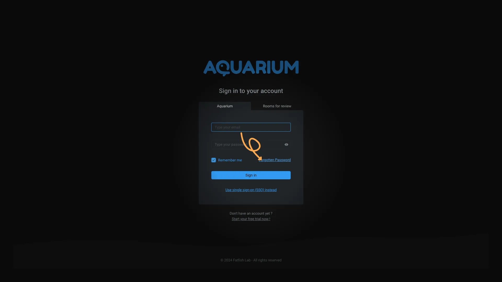
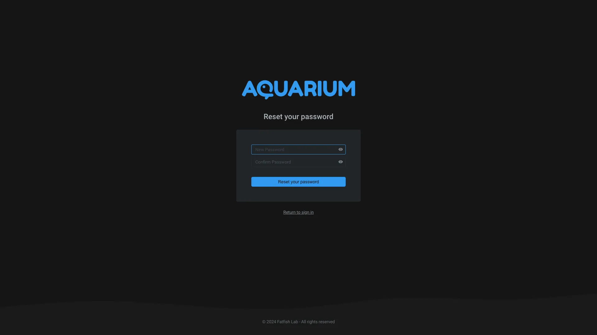

# How to reset password

1. From the sign-in page, you can reset your password by clicking on the `Forgot password` link.

2. Then you can enter your email address and click on the `Send reset link` button.

3. Open your mail-box, you will receive an email with a link to reset your password. This link is only valid for a one day.

> [!note]
> You can search for `Aquarium` in your mailbox to find the email.

You can also contact your domain administrator to reset your password.