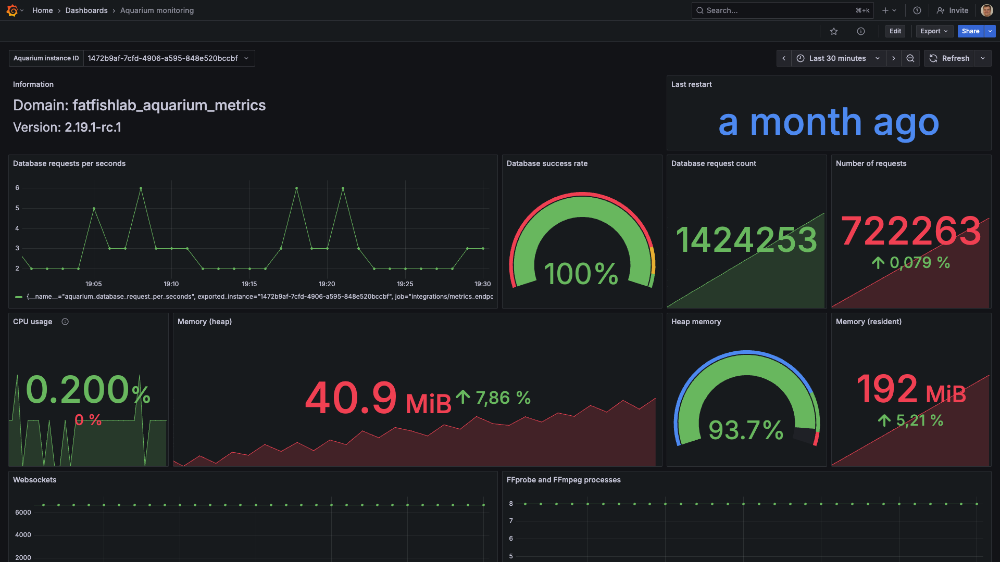

# Grafana

Aquarium is compatible with Grafana. You can monitor your Aquarium's instances using Grafana, but also Prometheus or any platform compatible with OpenMetrics.

>[!info] Grafana Cloud
> Start easily using [Grafana Cloud](https://grafana.com/auth/sign-up). Grafana Cloud is a fully managed, cloud-hosted observability platform that's ideal for those eager to get started without installation hassle. Their free tier is enought to monitor your Aquarium's instances.

## Requirements

Aquarium provide a dedicated endpoint to provide access to the metrics. This endpoint is not enabled by default. Check your server settings or [contact our support](../contact.md) to enable it. To check if the metrics are enabled, you can go to the [`Admin panel` > `Monitor` > `Metrics`](../web/applications/domain.md#monitor) section.

This endpoint requires a valid authentication token. The best is to use a dedicated Bot for that purpose.

## Configuration

### Bot creation

1. Go to the [`Admin panel` > `Bots`](../web/applications/domain.md#bots) section.
1. Click on the top right button `Create bot` and name your bot. Use `Grafana` for example.
1. Unfold the new bot and click on the + next to `Manage tokens` button.
1. Fill the form with the following information:
    - `Name`: The name of the token. Use `Grafana` for example.
    - `Expiration`: Choose a reasonable expiration date.
1. The token is automatically copied to your clipboard. Store it in a safe place for using it in the next step.

> [!warning]
> The bot doesn't need any specific permission.

### Grafana Cloud

Grafana provide a [dedicated guide](https://grafana.com/docs/grafana-cloud/monitor-infrastructure/integrations/integration-reference/integration-metrics-endpoint/) to configure the metrics endpoint.

1. In your Grafana Cloud stack, click `Connections` > `Add new connection` in the left-hand menu.
1. Find and select the `Metrics Endpoint` tile to open the integration.
1. Review the prerequisites on the Configuration page
1. Click on the top right button `Add a new scrape job`.
1. Fill the form with the following information:
    - `Job name`: The name of the job.
    - `Scrape Job URL`: The metrics endpoint URL, that you can find in the [`Admin panel` > `Monitor` > `Metrics`](../web/applications/domain.md#monitor) section.
    - `Scrape interval`: Every minutes is a great start.
    - `Type of Authentication Credentials`: Choose `Bearer` and paste the bot token you generated in the previous step.
1. Once scrape jobs is configured and tested, metrics will automatically appear in your Grafana.

## Dashboards

You can either create your own dashboards to monitor your Aquarium's instances, or use the dedicated dashboard we created for Aquarium.

Click here to [download the dashboard](../_medias/grafana-dashboard-overview.json).