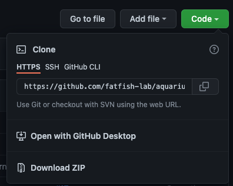
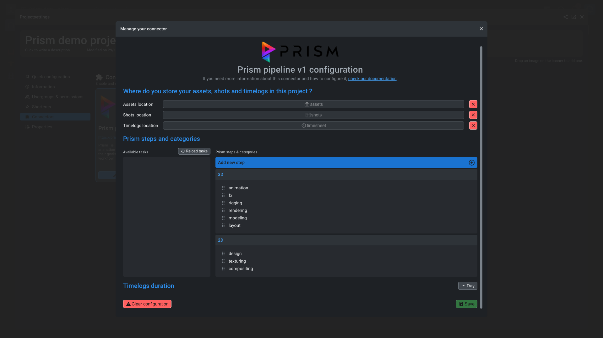
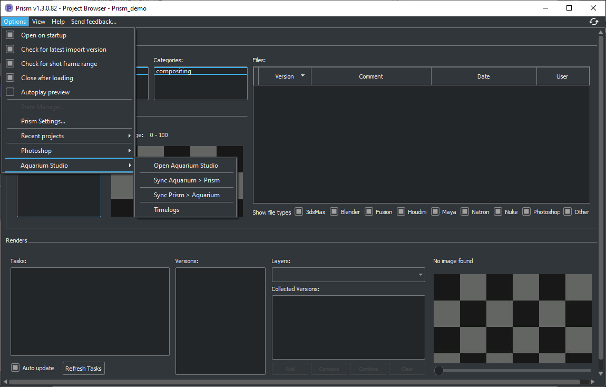
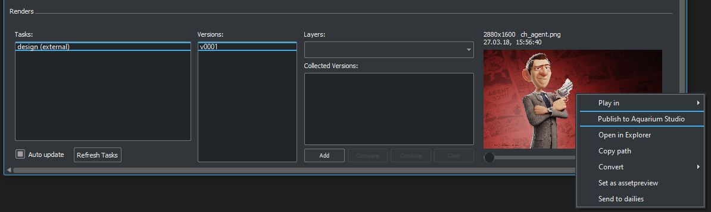
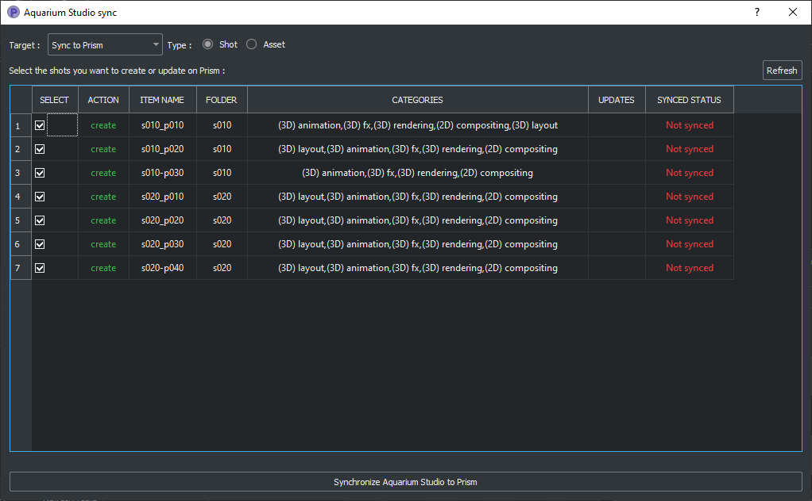
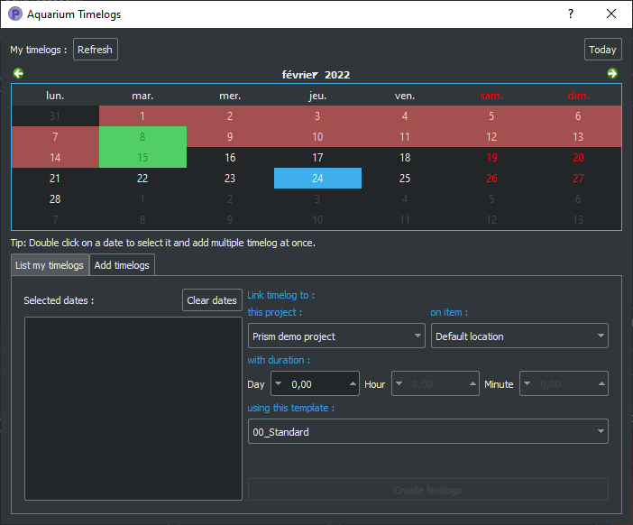
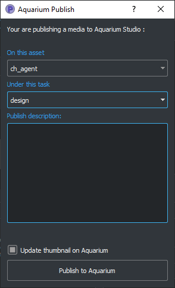

# Prism pipeline


The Aquarium plugin for Prism allow you to synchronize your project's assets and shots, publish media from to Aquarium and also create timelogs from Prism.

New features are coming ! Feel free to [reach us](/contact.md) if you have specific needs.

This documentation is for the Prism v1.3. The Prism v2 documentation is coming soon. More information about the v2 in our [repository](https://github.com/fatfish-lab/aquarium-studio-prism).

The code of the plugin is available in our Github : [github.com/fatfish-lab/aquarium-studio-prism](https://github.com/fatfish-lab/aquarium-studio-prism).

Check out the branchs and tags to see the different versions of the plugin.

# Installation

1. Open your command line
1. Go to the Prism's dedicated plugin folder for ProjectManagers
   > Example : `C:\Prism\Plugins\ProjectManagers`
2. Clone the repository in folder, with a custom directory name
```bash
    git clone ssh://git@github.com/fatfish-lab/aquarium-studio-prism.git Aquarium
```
3. Open Prism
4. Go to `Prism's settings` > `Plugins` tab
5. Enable `Aquarium` plugin
6. Configure Aquarium integration in Prism

### Alternative installation
If you are not familiar with `git`, you can download the repository from our Github, and paste the content in a folder named `Aquarium` in `ProjectMangers` folder in Prism's `Plugins` folder.



> Example : Extract the content of the zip file in `C:\Prism\Plugins\ProjectManagers\Aquarium`

# Configuration
To be able to use the plugin in Prism, you have to enable it, in your project Settings :

1. Open Prism
1. Go to `Prism's settings` > `Project Settings` tab
1. Enable `Aquarium integration`
1. Add your Aquarium site url
    1. To get your Aquarium site url go to your Aquarium instance
    1. On the `Dashboard` page, go to `Organisation` tab
    1. In the `Development` section, click on the `API url endpoint` to copy it
    1. Paste it in Prism
1. Click on the button `Save and go to 'User' tab to add your Aquarium credentials`
1. Add your `email` and `password` you use to connect to Aquarium
1. Click on the `Signin` button
1. Go back to the `Project Settings` tab
1. In the `Aquarium project` list, choose the corresponding Aquarium's project
1. Don't forget to save your modification by pressing the `Save` or `Apply` button at the bottom of the window

Now, we need to configure Prism, directly from Aquarium's web interface :




1. Go to your Aquarium instance
1. Open the project's settings
1. Go to the `Connectors` tab and click on `Enable connector` for Prism pipeline v1

### Where do you store your assets, shots and timelogs in this project ?
1. Choose your assets, shots and timelogs locations by picking the folder where you store them.

> - Those parameters are `optionnal`. If you let them empty, the project's will be used instead.

### Prism steps and categories
1. Drag and drop the `Available tasks` in Prism `steps` to create the categories.

> - In Aquarium, `steps` doesn't exist. So you can organize them as you want
> - The `categorie names`, need to match with the tasks name of your shots and/or assets to be synced by the connector
> - During `Aquarium to Prism sync`, if a task doesn't exist, the category will be ignored

> :warning: Don't forget to save the configuration before closing the window

### Timelog duration

Choose the available inputs (`day`, `hour` and/or `minute`) for artist to add their timelogs

### Use Prism naming convention

By using the Prism naming convention, you ensure compatibility of assets & shots names during sync.

> Prism as specific requirements for naming assets and shots. If you didn't follow those requirements, you can enable this feature.
>
> During the sync process, the connector will replace `-`, `_`, ` ` and `.` by the allowed symbols, based on your Prism settings.

# Update the plugin
To update your Aquarium plugin for Prism, you can use `git` commands

1. Open your command line
1. Go to the `Aquarium` prism's dedicated plugin folder: `C:\Prism\Plugins\ProjectManagers`
1. Pull the lastest changes
    1. `git pull`
1. (Re)start Prism or use the `Reload all plugins` button in Prism's settings > `Plugins` tab

# How to use the plugin

Once you configured the plugins, you can access to Aquarium tools fro mthe Prism `Options` menu :



1. `Open Aquarium`
2. `Sync Aquarium > Prism`
3. `Sync Prism > Aquarium`
4. `Timelogs`

`Publish to Aquarium` is available in the context menu (right mouse button) of the preview in `Renders` > `Tasks` section.



## Open Aquarium

Open Aquarium in your browser, directly in the active project.

?> Not yet enabled

## Sync Aquarium < > Prism

This menu allows you to sync your Assets and/or Shots data from Aquarium to Prism or Prism to Aquarium.




Before synchronizing the data, you will have a preview of the shots or assets that will be created, with the associated categories.

You can deselect items, with the checkbox on the left to exclude them for being synced.

!> The connector will never delete or trash data.

## Timelogs

Every connected users can create timelogs from Prism interface.



After selecting dates from the calendar view, you can create timelogs on specific project (active project is automatically selected). Fill the right duration and choose a `Timelog` template (optionnal).

?> You can double click on days, to create same timelog on multiple days.

Today you can't create timelog to specific task from Prism interface. If you need it, feel free to [contact us](/contact.md).

## Publish to Aquarium

When you right click on a image, sequence of image or video in Prism preview, you can upload this media directly on Aquarium.



Select the asset or shot (active item is automatically selected), choose the task under wich you want to upload the media and add a description (optional).

You can also update the thumbnail of the shot/asset with this media (optional).

# Signout

If you want to signout your account, go to `Options` menu > `Prism settings` > `User` tab and click on `Signout` in the `Connect to Aquarium` section.

!> Signout action only remove the authentication token from your computer. It doesn't delete or remove Prism configuration or data.

# Troubleshoot

If you have any issue with this plugin here is some lead :

- Check if an update of the plugin exist. Please refer to [update section](#update-the-plugin).
- Enable Prism `Debug mode`, in the `Prism settings` > `Miscellaneous`.
  - With this mode enabled, Aquarium plugin will also be in debug verbose output.
  - Prism logs are stored in the Document folder of the current user.
    - Example : `C:\Users\fatfishlab\Documents\Prism`
- We are here to help you, so do not hesitate to [contact us](/contact.md).

<div class="right">

If you have any questions or you have specific needs, [contact us >](/contact.md)

