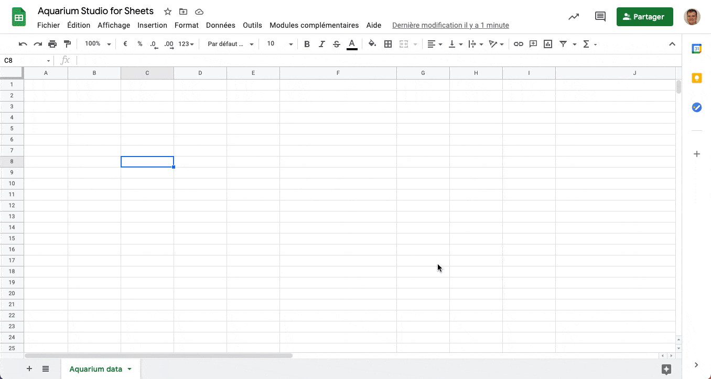
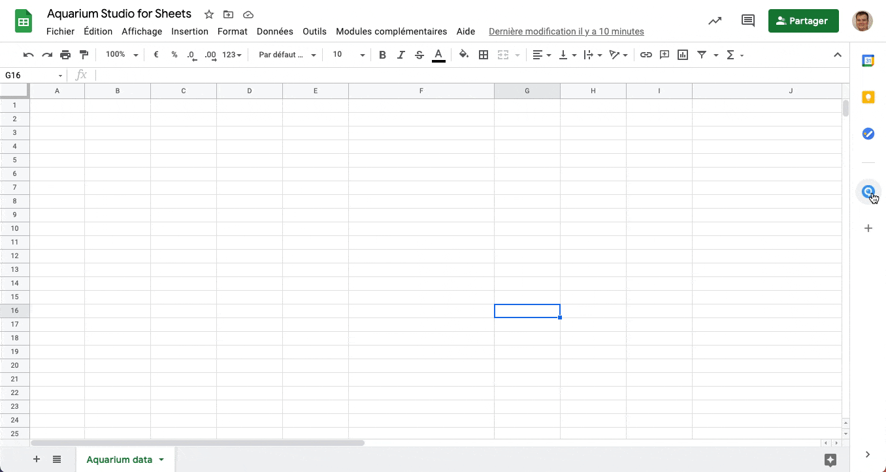

# Google Spreadsheet

Harness the power of Aquarium and the flexibility of Google Sheets without manually importing your data. Perfect for combining data from Aquarium with other department (budgeting, accounting, etc.) to generate reports, charts, and more.

With this addon you can:

- Import data from an Aquarium [workspace](../web/workspaces/index.md) into a Google Spreadsheet.
- Use our dedicated functions to get specific data from Aquarium.

New features are coming regularly. If you have any suggestions, please [contact us](/contact.md).

## Installation

Aquarium for Sheets is available on the [Google Marketplace](https://workspace.google.com/marketplace/app/appname/759195509032). You can access it via this link, or directly from within a Google Spreadsheet using the `Extensions` > `Add-ons` > `Get add-ons` menu or the side panel.

## Sign in

Once installed, you will need to sign in to your Aquarium account. You can do this by clicking on the `Extensions` > `Aquarium` > `Sign in` menu, or from the side bar.

## Functions

All functions are prefixed with `AQ_`. The functions are also documented in Spreadsheet, when you write them in a cell.

The following functions are available:

| Function | Description | Parameters | Return Value |
|:----------|:-------------|:------------|:--------------|
| `AQ_LOAD_WORKSPACE(startpoint, workspaceKey)` | Loads a workspace from Aquarium Studio | `startpoint`: Item key for query start `workspaceKey`: Workspace key for filtering | List of items and columns |
| `AQ_TIMELOGS(itemKey, depth, workingHours)` | Lists and imports timelogs | `itemKey`: Starting item key `depth`: (Optional) Max depth `workingHours`: (Optional) Hours per day | List of timelogs and columns |
| `AQ_TIMELOGS_MONTH(itemKey, month, year, depth, workingHours)` | Lists timelogs for a specific month | `itemKey`: Starting item key `month`: Month number (1-12) `year`: (Optional) Year `depth`: (Optional) Max depth `workingHours`: (Optional) Hours per day | List of timelogs and columns |
| `AQ_TIMELOGS_YEAR(itemKey, year, depth, workingHours)` | Lists timelogs for a specific year | `itemKey`: Starting item key `year`: (Optional) Year `depth`: (Optional) Max depth `workingHours`: (Optional) Hours per day | List of timelogs and columns |
| `AQ_GET_ITEM(itemKey)` | Gets a specific item and its data | `itemKey`: Unique item key | Item and its data |
| `AQ_GET_PROJECTS()` | Gets all projects | None | Project name and _key |
| `AQ_ME()` | Gets the connected user name | None | Connected user name |
| `AQ_URL()` | Gets the current Aquarium instance URL | None | Instance URL |
| `AQ_GET_ROOMS()` | Gets all rooms | None | List of rooms |
| `AQ_GET_ROOM_PLAYLISTS(roomKey)` | Gets playlists in a room | `roomKey`: Unique room key | List of playlists in the room |
| `AQ_GET_PLAYLIST_REVIEWS(playlistKey)` | Gets playlist reviews | `playlistKey`: Unique playlist key | List of reviews in the playlist |
| `AQ_DEBUG()` | Gets debug data for support | None | Debug data |

<$>[note]
In Aquarium, [we convert](../web/applications/organisation.md#properties) the duration `1 day` into working hours. The default value is 8 hours per day (1d = 8h). In spreadsheet functions (`AQ_TIMELOGS`, ...), you can specify the number of working hours to override the default value.
<$>

## Options

### Refresh data

You can manually refresh the data in your spreadsheet by clicking on the `Extensions` > `Aquarium` > `Refresh data` menu, or from the side bar.

### Sign out

You can sign out from your Aquarium account by clicking on the `Extensions` > `Aquarium` > `Sign out` menu, or from the side bar.

When you sign out, all the Aquarium data loaded with functions in your spreadsheet will be removed.

If you want to keep the data, you can use the option `Signout and keep existing data`.

## Templates

If you browser your [Project settings and go to `Connectors` tab](../web/applications/projectsettings.md#connectors), you can find a list of Spreadsheet templates.

If you are looking for a specific template or function, please [contact us](/contact.md).

