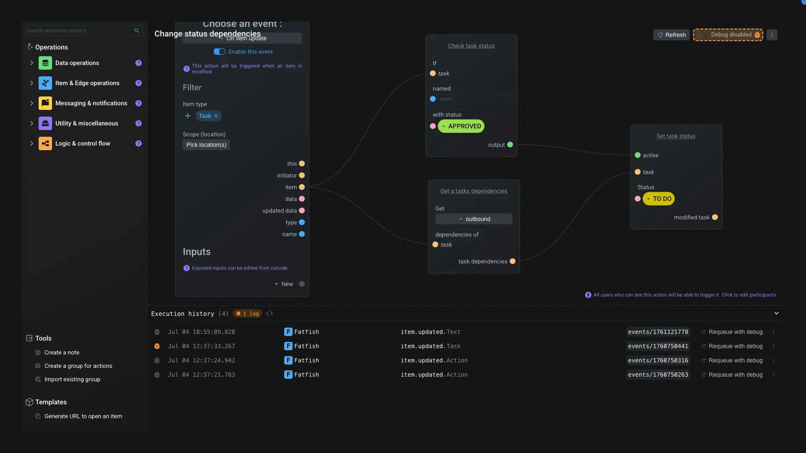

# Action editor

The action editor is the application used to edit [Action item](../items/action.md) in Aquarium.

An action is used to automate process. It's with this system that you can send notifications to users, set automatic status changes, etc. Some examples are available in the [add menu](./addmenu.md#form-creation) as templates. You can also checkout our [how-to guides](../../examples/index.md).

The goal of an action is to listen for a specific [event's topic](./domain.md#events) and execute the associated [Operations](../items/operation.md).

When you create an action, look at the templates available in the [add menu](./addmenu.md#form-creation) to discover some examples. Some of them are ready to use !

## Operations

In the sidebar, you can see the full list of the available operations.

At the end of the sidebar, you have special nodes :

- You can create **notes** in the interface, to add some comments or explanations.
- You can also **regroup** operations in a group node. It's useful to organize your action, make it more readable and reusable.
- You can also **import** an existing group.

> [!note]
> If you think that an operation is missing, [let us know](../../contact.md) ! We will be happy to add it to the list.

Click on an operation to add it to the action. You can also grab it and drop it in the action interface.

## Action interface

In this nodal interface you can see your Action and the operations. Each node have its specific interface and you can configure it by clicking on their options.

You can see that some nodes have inputs and outputs of different colors. Each color represents a type of data :

- In yellow, it's for items entity
- In blue, it's for text
- In pink, it's for objects
- In violet, it's for array
- In green, it's for booleans
- In grey, it's a neutral input/output. It's like a "dynamic type" based

You can only connects input to output of the same color. Except for neutral inputs/outputs, they can be connected to any other type.

There is a special operator called `Viewer` that you can use to debug your action and operations.

## Permissions

To allow users to trigger the action, they need to, at least, have the `Read` permission.

If a user doesn't have the `Read` permission, the action will not be triggered by the user's events.

You can edit the action [permission](../items/index.md#permissions) by click on the violet mention `Click to edit participants` at the bottom of the interface. It will open the [Quickeditor](./quickeditor.md#participants).
