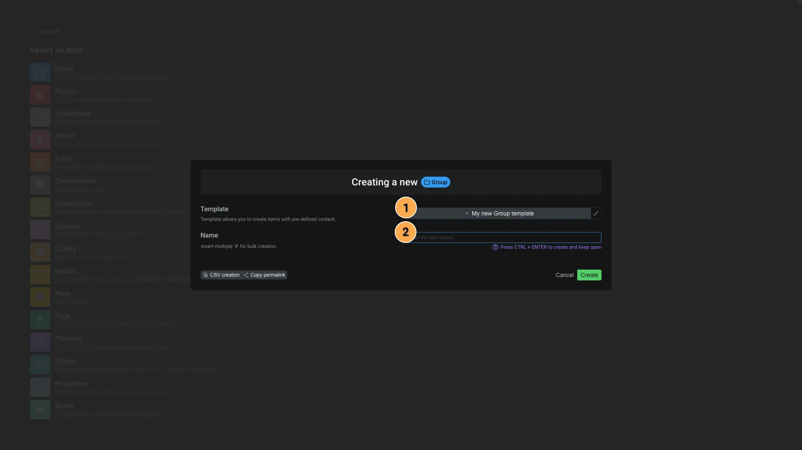

# Add menu

This application allow you to create new [items](/web/items).

1. **Breadcrumb**: The items will be created at this location.
2. **Search**: You can search any item type by typing in the search bar. If the type is not recognized, Aquarium allow you to create a new item type.
3. **Create**: You can select the type of item you want to create by clicking on the corresponding button. When you select a type, the application will display the form to create the item.

By default, we only provide relevant items types depending on the location you are creating the item.

> For example if you are in a [Sequence](../items/sequence.md), the interface will only display [Shot](../items/shot.md) and [Task](../items/task.md) types.

> [!info]
> When you search for an item, if only one type is displayed, you can press `Enter` to create the item.

## Form creation

Once you clicked on an item, the form creation will be displayed. By default we only asked for the name of the item. But using [templates](../items/template.md), you can defined more advanced form fields.

1. A [template](../items/template.md) is automatically selected for you. This menu allow you to:
   1. Create a new template
   2. Edit an existing template
   3. Create an item without a template
   4. Select another template
      - On some items, we provide some templates (ex: Actions, ...)
2. This input allow you to set the name of the item.

> [!info]
> If you use a `#` in the name of the item, Aquarium will automatically transform it into a incremented number. For example, if you create a shot named `s010_p##0`, Aquarium will create the shots `s010_p010`, `s010_p020`, `s010_p030`, etc.

[details How templates are displayed in the list ?

The templates are loaded based on where you are creating your item. Please refer to the **breadcrumb**  displayed in [Add menu](#add-menu).

If you are in a [Project](../items/project.md), by default, templates are hidden at the root of your project.

More details about [template are available in dedicated section](../items/template.md).
]