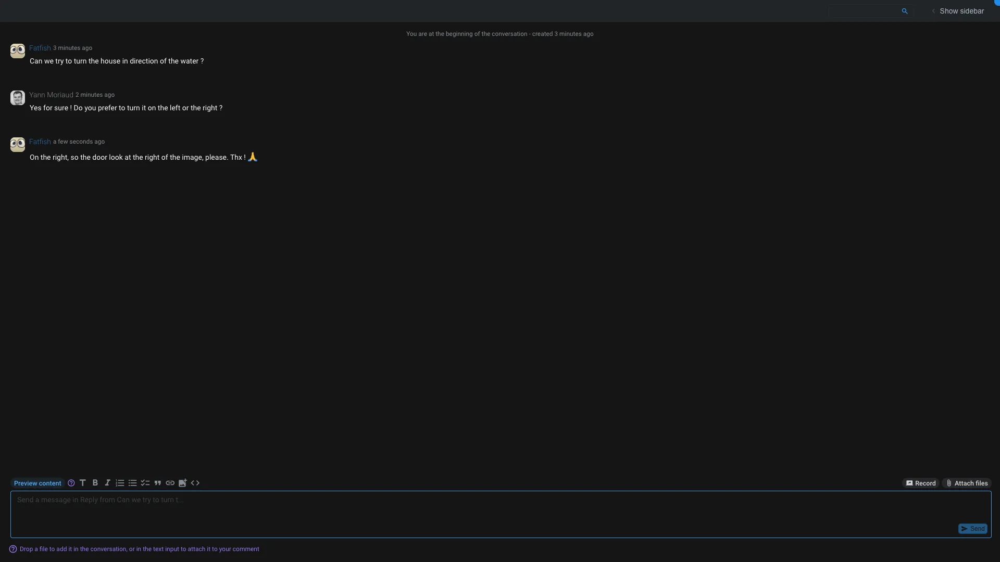

# Blah

The blah application is here to display comment like in an [Conversation](../items/conversation.md).

This interface is pretty straightforward, you can see the list of comments and write your own using the textarea. You can also drag and drop media to the conversation to share them with the other users.

The sidebar on the right is used to display several information about the conversation:

- **Status**: The current status of the conversation.
- **Participants**: The list of participants in the conversation.
- **Tags**: The list of tags associated with the conversation.
- **Attached to**: The item the conversation is attached to.
