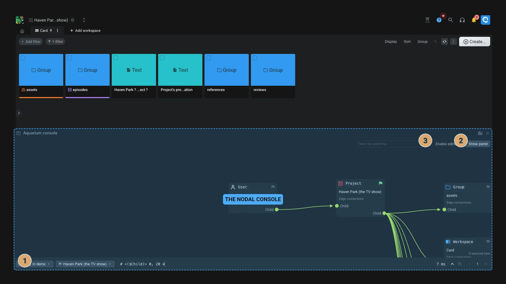

# Command

The Command application is a productivity tool that allows you to quickly access
to the most common actions on Aquarium.

You can press `SHIFT + :` (the `/` key) to open the Command application. From
the [studio interface](../introduction/studio.md), you can also click on the
search icon.

The available commands are:

| Command             | Description                                                                            |
| :------------------- | :------------------------------------------------------------------------------------- |
| Go to                | Go to your personal space, a project or an organisation                                |
| Browse               | Search and browse to items from your current folder                                    |
| Global search        | Search items into your entire Aquarium                                                 |
| Diary                | Open my diary to manage my tasks and my timelogs                                       |
| Profile              | Open my user profile and manage preferences                                            |
| Customer's club      | Open customer's club to manage requests                                                |
| Notifications        | See your notifications                                                                 |
| Administrative panel | Open Aquarium's admin panel to manage your domain, users, license and more             |
| Toggle media privacy | Hide or show all video and images from the interface for privacy, or take a screenshot |
| Focus                | Open your focus page                                                                   |
| Enable console       | Open Aquarium's console                                                                |
| Workspace            | Load another workspace                                                                 |
| ?                    | Open the help panel                                                                    |

<$>[info]
You can use the arrow keys to navigate through the list of commands and press `ENTER` to execute the selected command.
<$>

## Console (the nodal explorer)

The console is a powerful tool that allows you to explore the content of your Aquarium in a nodal way.

- **Browse**: From the console you can browse your items using a nodal interface. Click on the flag icon to use this item as the starting point of the query.
  1. You can also enter the _key of the item by clicking on the button.

2. **View item/edge data**: By clicking on an item, you can see its data and metadata using the right panel. You can also do the same by selecting an edge.
- **Custom query**: At the bottom you can change and write your own meshQL query to filter the items.
