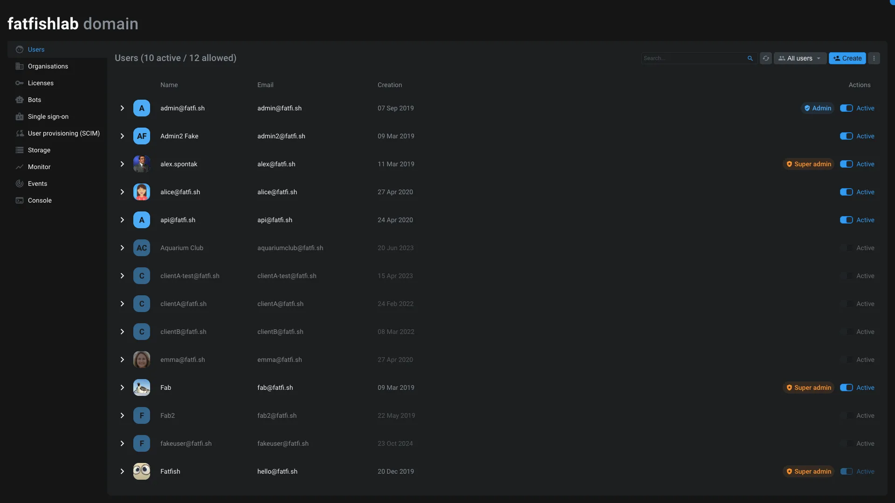
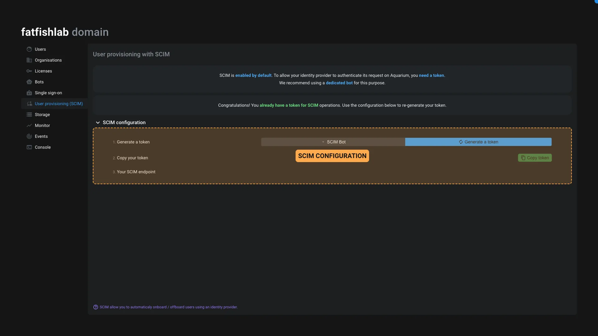

# Domain

This application is here to manage all administrative settings of your domain.

> [!warning]
> This application is only accessible to the administrator and super-administrator of the domain.



From this application, you can manage the following settings:

## Users

This section allows you to manage the users of your domain.

Users can be activate / deactivate from here. Deactivated users are not able to log in on the platform, but can still be accessible in the project to assign them tasks for example.

When you disable a user, all its sessions ends immediately.

To create a user, or multiple users at the same time, you can use the `Create` button on top of the interface.

> [!info]
> The only mandatory information to create a user is the email address.

When you create a user, and you don't set a password, the user will receive an invitation email. The invitation email is only valid for a certain number of days, after which the user will have to request a new link using the `Forgot password` link on the login page. Lean more on this process [in our dedicated guide](../../examples/tutorials/reset-password.md).

If you unfold a user, you can edit its information using the [Profile application](./profile.md).

You can also make its account as admin or super-admin.

### Admin and super-admin

> [!note]
> Aquarium works on the principle of domain system, like an Active Directory for example.

Being an admin or super-admin makes you member of `Domain admins` usergroup. By default this usergroup is present on all items. So admin and super-admin can access all projects for example.

The difference between an admin vs a super-admin, is that super-admin can edit domain settings like licenses, and manage users.

Here is a table explaining the differences between admin and super-admin:

| Feature | Admin | Super-admin |
| :--- | :--- | :--- |
| Have access to the domain application | <span style="color: var(--green-50);">Yes</span> | <span style="color: var(--green-50);">Yes</span> |
| Member of `Domain admins` usergroup | <span style="color: var(--green-50);">Yes</span> | <span style="color: var(--green-50);">Yes</span> |
| Promote to admin or super-admin | <span style="color: var(--red-50);">No</span> | <span style="color: var(--green-50);">Yes</span> |
| Create users | <span style="color: var(--red-50);">No</span> | <span style="color: var(--green-50);">Yes</span> |
| Edit users | <span style="color: var(--green-50);">Yes</span> | <span style="color: var(--green-50);">Yes</span> |
| Create usergroup | <span style="color: var(--red-50);">No</span> | <span style="color: var(--green-50);">Yes</span> |
| Access all items (like projects for example) | <span style="color: var(--green-50);">Yes</span> | <span style="color: var(--green-50);">Yes</span> |
| Manage [licenses](#licenses) | <span style="color: var(--red-50);">No</span> | <span style="color: var(--green-50);">Yes</span> |
| Manage [storage](#storage) | <span style="color: var(--red-50);">No</span> | <span style="color: var(--green-50);">Yes</span> |
| Manage [bots](#bots) | <span style="color: var(--red-50);">No</span> | <span style="color: var(--green-50);">Yes</span> |
| Use the [console](#console) | <span style="color: var(--red-50);">No</span> | <span style="color: var(--green-50);">Yes</span> |
| Can requeue [events](#events) | <span style="color: var(--red-50);">No</span> | <span style="color: var(--green-50);">Yes</span> |
| Manage [SSO](#SSO) | <span style="color: var(--red-50);">No</span> | <span style="color: var(--green-50);">Yes</span> |
| Manage [SCIM](#SCIM) | <span style="color: var(--red-50);">No</span> | <span style="color: var(--green-50);">Yes</span> |

> [!error] Use with caution
> If you don't want an admin or super-admin to access specific project, you can remove the `Domain admins` usergroup from the participant.

### Special permissions for events & SCIM

To avoid giving admin or super-admin permissions to users or bots that require only being able to use [Events](#events) or [SCIM](#SCIM) API, we introduced two specific permissions toggle:

- `Events`: Allow the user to interact with the events API and requeue events.
- `SCIM`: Allow the user to interact with the SCIM API.

> [!warning]
> The `SCIM` permission is not used to "setup" SCIM credentials. This permission only allows the user to authorize SCIM API requests.


## Organisations

This section allows you to manage the organisations of your domain. You can create as many organisations as you want. You can use an organisation to regroup users and projects together.

> [!info]
> Be default, users can't see each others, unless they are in the same organisation.
>
> If you need users from different organisations to collaborate, you can edit the organisation permissions to allow `Read only` on the other one (and vice versa).

Each organisation have their own settings that you can edit using the [Organisation application](./organisation.md).

## Licenses

This section allows you to manage the licenses of your domain. You can see the number of licenses you have, and the number of licenses you are using. You can also edit you license to request more active users and storage.

Here is a short video [from our guide](../../examples/tutorials/manage-licenses.md), explaining how to manage your licenses:

[youtube DnCszP4uk0U]

> [!warning]
> If you think that your license is not updated after you requested more/less active users or storage, you click on the <span class="aq-icon">cached</span>  refresh button next to the `Upload license` button.

> [!info]
> If you need more than one license to have separate billing, [contact our sales team](../../contact.md).

## Bots

This section allows you to manage the bots of your domain. You can create as many bots as you want. Bots works like users, you can invite a bot to a project, usergroups, organisations. Except that a Bot can't log in on the platform, just use the API.

You can use bots to authenticate your scripts to the API.

A bot can be promoted to admin or super-admin, and you can activate/deactivate it.

## SSO

SSO is the abbreviation of Single Sign-On. It's here to allow you users to use external credentials to log in on Aquarium. Like using their professional credentials instead of having to remember a new password.

[youtube 49qQzHLhPWM]

Our SSO integration is only compatible with OpenID Connect (OIDC) standard. You need to use a provider that is compatible with OIDC, like Google Workspace, Okta, Microsoft Entra, ...

Here is Aquarium's requirements :

- Authentication with client secret
- Authorization Code
- Minimum scopes: openid, email
- PKCE as additional verification

> [!warning]
> Today, only Okta is compatible with user groups synchronisation. If you use another provider, feel free to [contact us](../../contact.md) to see if we can help you.

To configure SSO, you need to fill the following fields:

| Field | Description | Required |
| :--- | :--- | :--- |
| Authorization endpoint | The URL to redirect the user to authenticate | <span style="color: var(--green-50);">Yes</span> |
| Token endpoint | The URL to get the token | <span style="color: var(--green-50);">Yes</span> |
| Client ID | The ID of your application | <span style="color: var(--green-50);">Yes</span> |
| Client secret | The secret of your application | <span style="color: var(--green-50);">Yes</span> |
| Allow sign-up with SSO | Automatically create an Aquarium account if its doesn't exist yet | <span style="color: var(--red-50);">No</span> |
| Create non-existing users | Create users that don't exist yet | <span style="color: var(--red-50);">No</span> |
| Synchronize user groups | Synchronize user groups from your provider | <span style="color: var(--red-50);">No</span> |

[details How to configure with Google Workspace ?

1. Here is a [Google documentation explaining how to enable OIDC](https://developers.google.com/identity/openid-connect/openid-connect#appsetup) for your domain.
2. Once you followed their explanation for `Setting up OAuth 2.0`, you can filled the following fields in Aquarium:
   - Authorization endpoint: `https://accounts.google.com/o/oauth2/v2/auth`
   - Token endpoint: Leave it blank, we will detect it automatically
   - Client ID: The client ID you got from Google
   - Client secret: The client secret you got from Google
3. Press save and you are done!
]

[details How to configure with Okta ?

Here is a short video showing how to configure Okta with Aquarium:

[youtube GpeRE_kO5UE]

1. Here is a [Okta documentation explaining how to setup OIDC app integrations](https://help.okta.com/en-us/content/topics/apps/apps_app_integration_wizard_oidc.htm) for your domain.
2. Once you followed their explanation, you can filled the following fields in Aquarium:
   - Authorization endpoint: `https://your-domain.okta.com/`
   - Token endpoint: Leave it blank, we will detect it automatically
   - Client ID: The client ID you got from Okta
   - Client secret: The client secret you got from Okta
3. Press save and you are done!
]

## SCIM

[SCIM](https://scim.cloud) is the abbreviation of System for Cross-domain Identity Management. It's here to allow you to synchronize your users and usergroups from your identity provider to Aquarium.

It's perfect if you want to automate user onboarding and offboarding and increase security by allowing your IT to use a centralised platform to manage users and group assigment.

You can use SCIM with any provider that is compatible with SCIM, like :

- Microsoft Entra ID
- [Okta](https://okta.com)
- [Authentik](https://goauthentik.io/)
- And others...

### Authentication

Our SCIM implementation uses OAuth Bearer Token for authentication. This ensures secure and authenticated communication between your identity provider and Aquarium, allowing for seamless synchronization of users and user groups.

### How to configure SCIM ?

You will need to obtain a Bearer Token from Aquarium to authenticate your identity provider. The best is to use a dedicated Bot with Super-admin or SCIM permissions. All that process is automated from the SCIM tab in the domain application.



1. Create a new Bot or select an existing bot from the dropdown.
2. Press the `Generate token` button.
3. Copy the token and paste it in your identity provider.
4. Copy the SCIM endpoint and paste it in your identity provider.

> [!info]
> Aquarium uses the email of a user to uniquely identify them in the SCIM API. So if your identity provider lets you choose the `userName` used in the SCIM API, you should use the `email` or its equivalent.
> If you don't use the email as SCIM `userName`, you will have errors when trying to sync an existing user.

[details How to configure SCIM with Okta ?

Here is a short video showing how to configure Okta with Aquarium:

[youtube L5BjPSveDQ8]

]

If you need help to configure SCIM with your identity provider, feel free to [contact us](../../contact.md).

## Storage

This section allows you to manage the storage of your domain. All your upload files and medias will appear here.

You can filter your files and delete them to release storage. You can also click on a file to see the file, its metadata and locate it in your items.

A file can be used on multiple items, to save space and money. That's why the locate section can display multiple items.

## Monitor

This section provide 3 graphics to monitor your Aquarium instance:

- Queries per second
- Number of [Jobs](./jobs.md)
- Number of [events](#events) being processed

## Events

From this section, you can see all the events that have been processed by Aquarium.

An event has a `topic` that represent the type of event. The `topic` is a string composed by : `[custom].category.verb.[entity type]`. The entity type is here to help you filtering then events.

> Example: `item.created.Shot`, `edge.removed.Child`, `custom.{your.event}`, ...

> [!info]
> The conjugation of the verb is helping you to understand if the activity associated with the event already happened (past tense, ex: `item.created`) or is going to happen (present, ex: `file.encode`).

Here is a list of the topics that Aquarium generates:

- `edge.created`: Event triggered when an edge is created.
- `edge.removed`: Event triggered when an edge is removed.
- `edge.updated`: Event triggered when an edge is updated.
- `events.ticked`: Event triggered at each tick of the system.
- `file.encode`: Event triggered when a file is start encoding.
- `file.vectorscope`: Event triggered when file start encoding has vectorscope (used for sound file).
- `item.created`: Event triggered when an item is created.
- `item.removed`: Event triggered when an item is removed.
- `item.updated`: Event triggered when an item is updated.
- `permission.copied`: Event triggered when a permission is copied.
- `permission.created`: Event triggered when a permission is created.
- `permission.removed`: Event triggered when a permission is removed.
- `permission.updated`: Event triggered when a permission is updated.
- `user.mentioned`: Event triggered when a user is mentioned. This event is triggered each time a user is mentioned.
- `users.mentioned`: Event triggered when users are mentioned. This event is triggered only once even if multiple users are mentioned. This event is also triggering even if only one user is mentioned.
- `custom.[...]`: You can trigger custom events using the API.

You can click on an event to see its metadata and data. You can also visualize the event in a nodal interface, where you have :

- The event connected to the item that emitted it
- The chain of reaction. Some actions (like when you append an item) can trigger multiple events, so you can see the propagation of the event.
- The [Action](../items/action.md) items that have been triggered by the event.

All the event can be requeue to be processed again.

> [!info]
> When you re-queue an event, Aquarium does not trigger the original activity that emit the event. Its only retriggers the [Action](../items/action.md) items that are listening for this event.

> Example: If you re-queue an `item.created` event, Aquarium will not create the item again. But if you have an action that is triggered by the `item.created` event, this action will be triggered again.

## Console

This section allows you to access to the online CLI to trigger some commands. Try to type `help` to see the available commands.

```shell
INFO Aquarium CLI
------------
flags                                        Lists the flags this instance is running with.
version                                      Get the version of Aquarium server.
status                                       Get domain status.
# meshql expression                          Execute a meshql query.
jobs                                         Get the jobs queue length.
events                                       Get the events queue length.
janitor                                      Analyze the database.
janitor -x                                   Cleanup the database.
trash                                        Count trashed elements. Type 'trash -x' to clear.
trash -x                                     Empty trashes.
cache -x                                     Refreshes the cache containing the users and licenses.
--
```