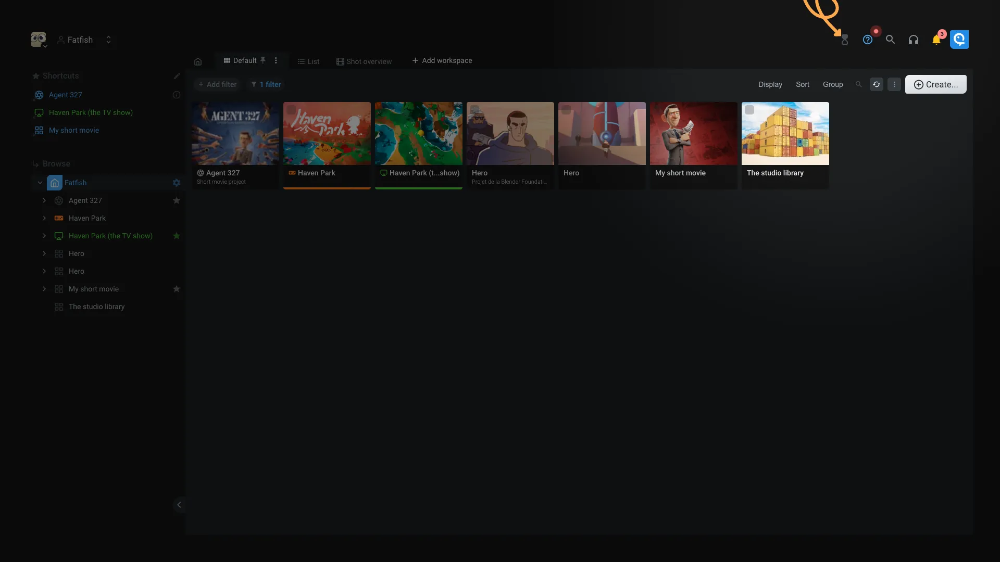

# Jobs

Some operations require some time to be processed. For example, when we encode a video file, when you trash a lots of items, or when a lots of permissions are propagated.

To be able to track those operations called `Background jobs`, Aquarium use this application to show the list and progression of the connected users jobs.

The application is available in the Aquarium menu, or if you are using the studio interface, you have a dedicated button.

> [!warning]
> Today, you can only see your own jobs. We are working on a feature to allow admin and super-admin you to see all the jobs of the platform.