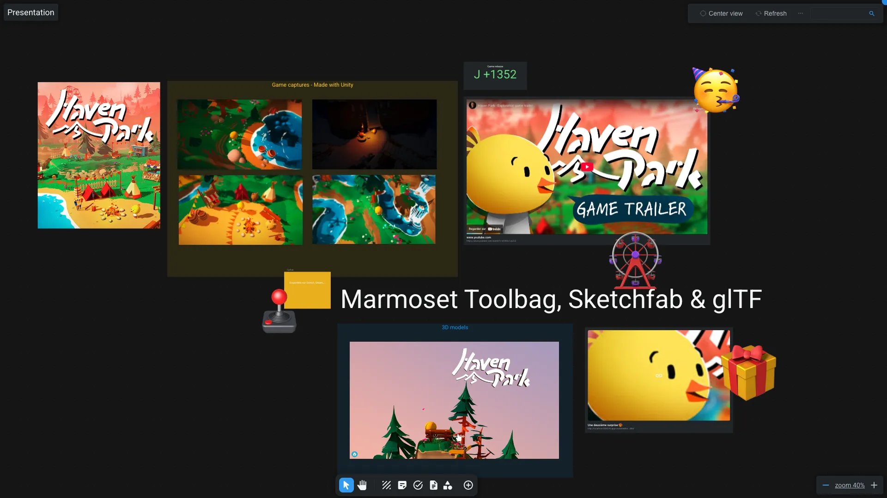

# Nodal

The nodal application is dedicated to open [Whiteboard](../items/whiteboard.md) items.

The whiteboard is a collaborative tool to create boards for references, moodboards, custom dashboards, meetting support, ...

You can create and or import existing items in this whiteboard, create shape, backdrop, sticky notes, and more.

Use the toolbar at the bottom to quickly :

- Enable edition mode to select and move items in the whiteboard. (Shortcut `V`)
- Enable pan mode to only move the view. (Shortcut `Space`)
- Create a backdrop
- Create a sticky note
- Create a task
- Create a text
- Create a shape
- Click on the add_circle to:
  - Create a new item
  - Import an existing item
  - Link a workspace