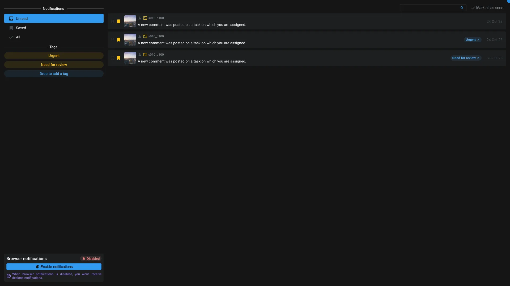

# Notify

This application allow user to see its notifications.

From this application, you can see all the notifications that you have received. You can also mark them as read or unread.

You can save a notification by clicking on the bookmark icon.

You can add tags on your notifications to regroup them together and categorize them. For that just drag and drop a notification on an existing tag or on `drop to add a tag`.

<$>[info]
Notifications are sent using the [action](../items/action.md) system.
Check our [how-to guide to setup your own notifications](../../how-to/setup/notifications.md).
<$>