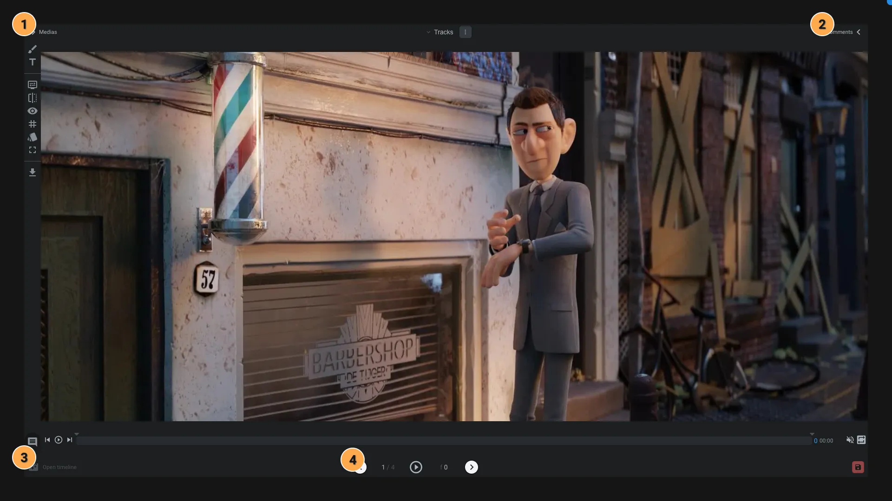

# Playlist

This application is used to edit and visualize [Playlist items](../items/playlist.md).

> [!info]
> Don't forget to try our [Review workspace](../workspaces/review.md). It's a good tool to create quick playlist.

1. **Medias**: Open/close this panel to see the list of medias in the playlist.
2. **Comments**: Open/close this panel to see the comments of medias on screen.
3. **Timeline**: Open/close the timeline of the playlist.
4. **Controls**: Select the previous or next media and play/pause the playing of the playlist.