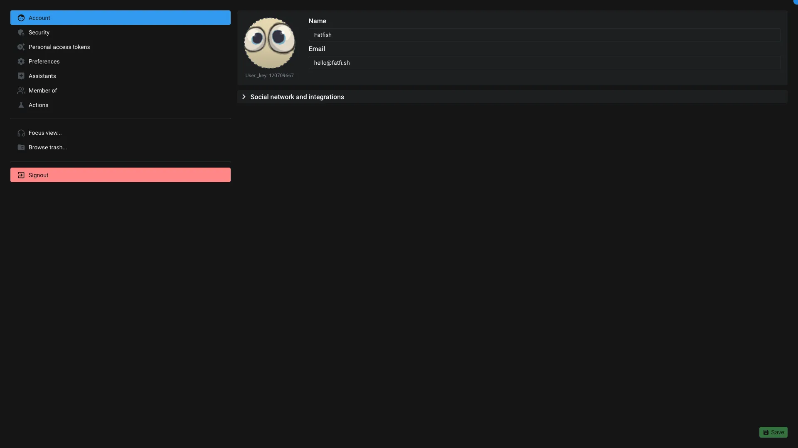

# Profile

This application is dedicated to edit [User item](../items/user.md).

If you open the profile application with another user than you, some options might be disabled, depending your permission level.

## Account

You can edit general information about the user: name, email, thumbnail and social networks details.

Just under the thumbnail, you can find the item._key of the user. This is the unique identifier of the user on Aquarium.

## Security

You can change your password, enable multi-factor authentication and close all sessions.

The `Close all session` allow you to disconnect all your sessions and will force the user to sign-in again.
> As an administrator, you can disconnect other users.

> [!warning]
> When you change your password, we will ask you to sign-in again. It will also disconnect all your other sessions.

You can also enable and manage the two-factor authentication (2FA, MFA, ...). You backup code can be manage from here too.

### Multi-factor authentication

Aquarium supports 2 types of multi factor authentication:

- **Authenticator app**: you can use any authenticator app (Google Authenticator, Authy, ...) to generate the code. You can scan the QR code or copy the secret key. It's compatible with any authenticator app like:
  - [Google Authenticator](https://support.google.com/accounts/answer/1066447?hl=en)
  - [2fas](https://2fas.com/)
  - [Authy](https://authy.com/download)
  - [Duo Mobile](https://duo.com/product/multi-factor-authentication-mfa/duo-mobile-app#download)
  - [Microsoft Authenticator](https://www.microsoft.com/security/mobile-authenticator-app)
- **Passkeys & security keys**: with passkeys, you can securely sign in to your account using just your fingerprint, face, screen lock, or security key (like [Yubikeys](https://yubico.com)).
  - You can also use your phone as a security key. In order to do so:
    1. Login to your account from your phone
    2. Go to your `Profile` > `Security` tab > click on `Add authentication device`.

> Your phone ecosystem (Android or iOS) will take care of sending a notification to your phone when you need to authenticate from a computer.

> [!note]
> You can use both methods at the same time, but only one Authenticator app can be used at a time.

> [!error] Backup codes
> If you lose your authenticator app or if you don't have access to your phone, you will not be able to sign-in again. So please make sure to save the backup code in a safe place.

If you are an administrator and you want your users to enable 2FA, you can share with them this URL: `https://[studio.example.com]/profile/mfa/new`.

### Troubleshooting 2FA errors

If you encounter errors when enabling 2FA, you can try the following:

- Make sure your device has its clock set correctly. The clock must be set to your correct timezone and time must be accurate. It is best to ensure your device is synchronized with your network time.
- Make sure the code you entered is still valid. Authenticator apps generate a new code every 30 seconds.

If you still encounter errors, you can contact our [support team](../../contact.md) for assistance.

## Personal access tokens

Sometimes, instead of providing your password, you can use a personal access token to authenticate yourself in some tools. You can create, revoke and manage them from here.

## Preferences

You can change the [default interface](../introduction/index.md#how-can-i-use-aquarium-) and choose the default theme (`light`, `dark` or `system` to automatically switch between light and dark theme depending on your system preferences).

By pressing `F1` or by clicking on the help icon, Aquarium provide quests to help you to discover the application. You can reset your quests from here.

You can also enable browser notifications from here. So you will be notified from your operating system (OS) that you received a new notification on Aquarium.

If you already enabled the browser notifications, you can revoke the permission from here.

## Assistants

Like in the [Organisation](../applications/organisation.md#assistants) and [Project settings](./projectsettings.md#assistants), you can enable/discard assistants from here.

## Member of

This panel show you the list of organisation and user group the user is member of.

## Actions

You can see and manage all the [Action](../items/action.md) accessible to you.

You can filter the list of actions, to quickly find the one you are looking for.

You can create new one from here, using our existing templates or by creating a new one from scratch.

Once an action is created, you can click on the launch icon to edit it, using [its dedicated application](./actioneditor.md).

You can also enable/disable actions from here.

> [!warning]
> Actions can be triggered by any user who have at least the permission to read the item.
> So it's super easy to deploy an action for a group of user of for the entire organisation. You just need to invite them on this item. Open the [Action editor](./actioneditor.md) to learn more.

## Focus view

Open the [Diary in the focus interface](../introduction/focus.md#diary) of the user in a new tab.

## Browse trash

Open the [Trash](./trash.md) of the user.

## Signout

Sign-out from your Aquarium session.