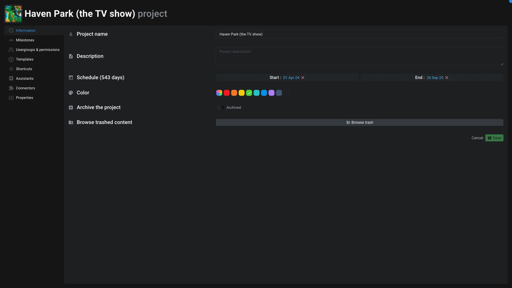

# Project settings

This application is used to edit [Project item](../items/project.md).

## Informations

You can edit general information about the project: name, description, thumbnail, start date and deadline.

You can also archive/unarchive the project. Archiving a project is just a flag on the project. All you data remain intact and accessible. The project is "just" hide in the project selector.

You can also browse the trash of the project from here.

## Milestones

You can create and manage milestones for the project. A milestone is a specific point in time, like a delivery date, a review, etc.

To create a milestone, click on the add in a specific day. Name your milestone and once it's created you can click on it to edit it. It will open the [milestone editor application](./milestones.md)

## Usergroups & permissions

From this tab you can manage the user groups and permissions of the project.

You can create new user groups and edit them. When you create a user group from here, it will be automatically invited are `Read only` to the project.

In the `Shared with` section, you can see all organisations, user groups, users and bots that have access to the project. You can also see the permission level of each of them.

Click on a permission to edit it and change its level. Please refer to [items permissions](../items/index.md#how-can-i-manage-items-permissions-) for more information.

> [!warning]
> On big projects, to keep high performances, we recommend to only use Organisation or User group permissions.

## Shortcuts

When you use the [Aquarium Studio interface](../introduction/studio.md), you can add shortcuts to the [dock](../introduction/studio.md#dock).

This section allow you to manage those shortcuts. You can add or remove them. You can also edit its icon, color and description.

## Assistants

When you use the [Aquarium Studio interface](../introduction/studio.md), assistants are provided to help you to create and manage your projects. Those assistants appear in the [Homepage workspace](../workspaces/homepage.md).

When an assistant is finished, it's automatically discarded. This interface allow you to manage those assistants, to manually discard them or to enable them again.

## Connectors

Connectors are used to connect Aquarium to external services :

- [Prism pipeline](../../integrations/prism.md)
- [Ayon](../../integrations/ayon.md)
- [Google Spreadsheet](../../integrations/spreadsheet.md)
- [Syncsketch](../../integrations/syncsketch.md)

## Properties

You can edit default Project's properties from this section.

You can define the statuses that are available for the project. Those status are mainly used for [Tasks](../items/task.md).

Those status are merged with the [Organisation's statuses](./organisation.md#organisation's-statuses).

Find out more about statuses in the [Tasks](../items/task.md) documentation.