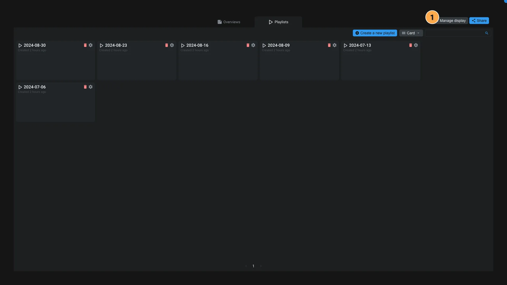
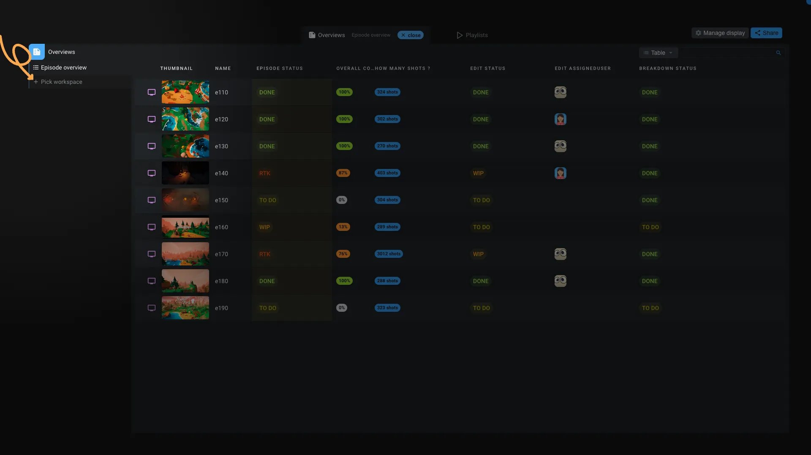

# Rooms

The rooms application is used to edit and manage [Room items](../items/room.md) and it's very similar to the [Rooms interface](../introduction/rooms.md). But with extra options to edit the displays and share the room with other users.

1. **Manage display and sharing**: You can manage the displays in the room and share it with other users.
   1. **Displays**: There are two types of diplays in a room: `Overviews` allow you to share [workspaces](../workspaces/index.md) as read only to external users. `Playlists` allow you to share [playlists](../items/playlist.md) to gather reviews.
   2. **Sharing**: You can invite new users and edit existing participants to edit their permissions. You can also open this room in the [Rooms interface](../introduction/rooms.md) and also directly copy that link to share it by email to other users.

## Playlists

You can create new playlists directly from this interface. But you can also use our dedicated [Review workspace](../workspaces/review.md) to create playlist directly from your production data.

## Overviews

You can create new overview by clicking on `Pick a workspace`.

An overview is like a workspace but where all the data, columns are in read only. You can edit the content of the overview or open any item. That's useful if you want to share a workspace with external users without giving them access to the all project.

An overview is not automatically updated when the workspace is updated. You need to manually update the overview to see the latest changes. So you have the control over the data you want to share. To update the overview, click on the more_vert icon and select `Refresh`.

Do not hesitate to create dedicated workspaces, so you know that the workspace is used for external users.