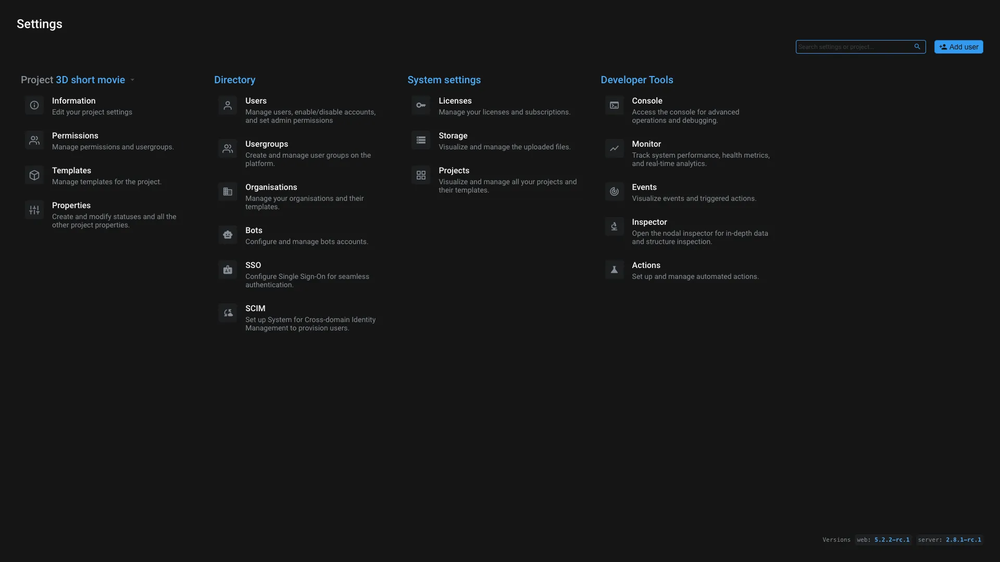

# Settings

This application give you an overview of all accessible settings on Aquarium. Perfect for quick access to [domain settings](./domain.md), [project settings](./projectsettings.md) and all developers tools.

> [!info]
> In Settings's interface, use the `search` field to quickly find the setting you are looking for. FYI, we focus this inpute automatically when you open the application.

From this application, you can manage the following settings:

- Project settings
  - [Information](./projectsettings.md#information)
  - [Permissions](./projectsettings.md#usergroups-%26-permissions)
  - [Templates](./projectsettings.md#templates)
  - [Properties](./projectsettings.md#properties)
- Directory
  - [Users](./domain.md#users)
  - [Usergroups](#usergroups)
  - [Bots](./domain.md#bots)
  - [Organisations](./domain.md#organisations)
  - [SSO](./domain.md#sso)
  - [SCIM](./domain.md#scim)
- System settings
  - [Licenses](./domain.md#licenses)
  - [Storage](./domain.md#storage)
  - [Projects](#projects)
- Developers
  - [Console](./domain.md#console)
  - [Monitor](./domain.md#monitor)
  - [Events](./domain.md#events)
  - [Inspector](./command.md#console-(the-nodal-explorer))
  - [Actions](./profile.md#actions)

## Usergroups

Usergroups are global to your domain. They are used to regroup users (and bots) together and easily manage permissions. You can create, edit and delete usergroups from here.

This interface allows you to manage all usergroups of your domain, manage its members and trash the group if needed.

> [!info]
> Since usergroups are global to your domain, we advise you to name them with a project short code or any other relevant information for easy identification. To help you locate the usergroups, their locations are displayed in this interface. Simply click on the location name to open the corresponding project.

## Projects

This section allows you to manage all projects of your domain. You can see all active and archived projects. You can also create a new project from here.

When you click on a project you can edit all [its settings](./projectsettings.md).