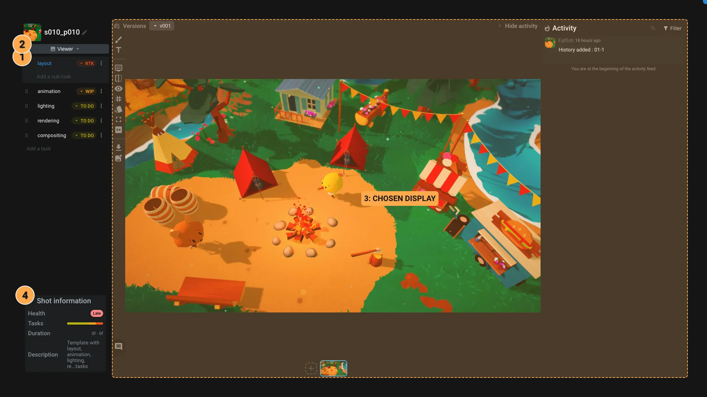
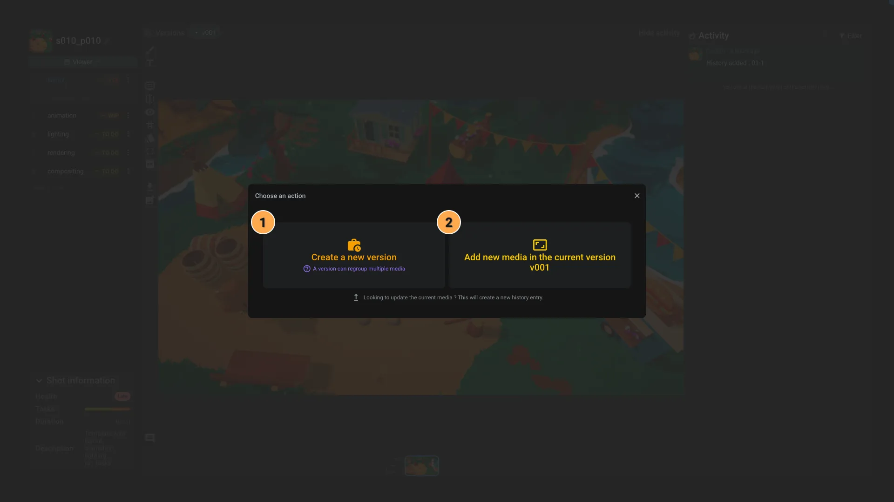

# Shot editor

The Shot editor is the application dedicated to edit [Shot item](../items/shot.md).

1. **Tasks**: The list of tasks associated with the Shot. You can click on a task to visualize its Medias. A task can have sub-tasks.
2. **Display**: Choose the display mode of the shot. You can define the default display by clicking on the star icon. The available display modes are:
     - **Viewer**: Display the selected task's medias. Refer to the [Viewer documentation](viewer.md) for more information on how to annotate and leave comments on the medias.
     - **Comments and retakes**: Display the selected task's comments and retakes without having to select a version/media from the Viewer. When you click on a comment or retake, the associated medias is displayed on the right.
     - **Overview**: Get all selected tasks activity in one quick overview.
     - **Attachments**: Display the shot's attachments. You can attach any item, like a media, a whiteboard, ... for references or to share information.
3. **Chosen display**: Depending on the display mode, the content of the Shot editor will change.
4. **Shot information**: The Shot's global information :
     - **Health**: The health of the shot. It is using all the tasks health to determine the shot health.
     - **Tasks statuses**: A progress bar showing the status of the tasks.
     - **Duration**: The total duration of the shot based on the data `frameIn` and `frameOut` of the shot.
     - **Description**: The shot's description.

## Viewer display

The Viewer display mode is the default display mode of the Shot editor. It allows you to visualize the selected task's medias and to annotate and leave comments on them.

### Regroup medias into versions

Depending on your workflow, you might want to regroup medias into versions. A version is a way to regroup medias that are related to each other. You can create as many versions as you want.

When you drag and drop a media file on the interface, a popup will appear to ask you if you want to create a new version or add the media to an existing version.

1. **New version**: If you select `New version`, a new version will be created with the media you just uploaded. We automatically detect the version number based on the existing versions. You can override it if needed.
2. **Current version**: The media will be added to currently selected version. All medias added to the same version will be displayed at the bottom of the viewer.
