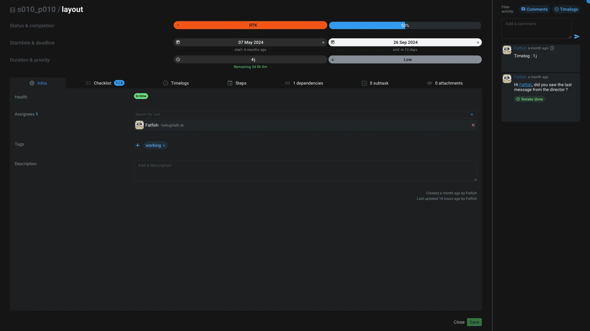

# Tasks editor

This application is used to manage [tasks](../items/task.md).

The top section allow you to edit some basic informations about the task:

- **Name**: The name of the task
- **Status**: The status of the task. Available status are defined in the [Organisation](./organisation.md#properties) or in [project settings](./projectsettings.md#properties).
- **Completion**: The completion of the task. It's a percentage. It's driven by the status, but can be adjusted manually.
- **Start date**: The date when the task start
- **Deadline**: The date when the task end
- **Duration**: The duration of the task. It's a manual data that you can provide.
- **Priority**: The priority of the task. It's a number, the lower the number, the higher the priority.

At the bottom you have several tabs to manage other informations :

## Infos
- **Health**: A visual representation of the task's health. It's an aggregation of multiple information: the number of days before the deadline, the completion, the number of [retakes](../items/comment.md#retakes) that are still opened, how many days the artists already work on the task compared against the duration of the task, ...
- **Assignees**: The list of [users](../items/user.md) assigned to the task
- **Tags**: The list of tags associated to the task
- **Description**: A text area to describe the task

## Checklist

A checklist is a list of items that you can check or uncheck. It's a way to track the progress of the task and also to provide an easy sub-tasks list, without the need to create sub-tasks.

## Timelogs

You can see all the timelogs of the task in a calendar view. You can also add new timelog from this tab.

To remove a timelog, you need to search for it in the [activity sidebar](#activity).

## Steps

A step is a mini milestone dedicated to the task. It's a way to split the task in smaller parts. We will also show you the start date, the deadline and today's date to help you to see if you are on track.

## Dependencies

You can add dependencies to the task. A dependency is a connection between two tasks using a `Dependency` edge.

You are able to visualize the inbound and outbound dependencies of the task.

## Subtask

You can create subtasks from this tab. A subtask is a task that is a child of the current task. It's a way to split the task in smaller parts.

> [!note]
> Don't forget that you can use the [checklist](#checklist) to track small things to do without the need to create subtasks.

## Attachments

You can attach other items to a task, like for reference, context or any other reason that make it relevant for you.

## Activity

On the left you have the activity sidebar that regroup all the comments and timelogs of the task. You can filter that list by clicking on the `Comments` or `Timelogs` buttons.