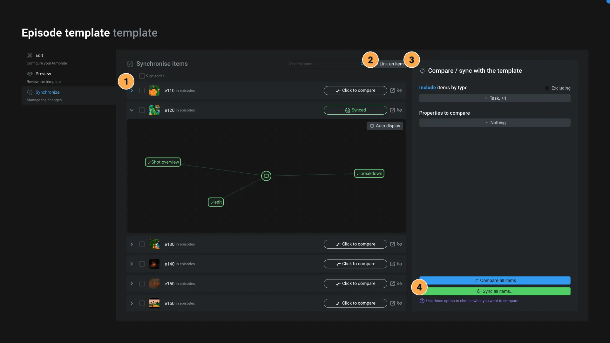

# Template editor

The template editor is the application dedicated to edit [templates](../items/template.md).

[youtube CsKs6q-UYNE 405 720]

This application have 3 tabs on the left to manage its data, content and linked items.:

## Information

You will find some general information about the template:

- **Name**: The name of the template
- **Template type**: The type of the item that can use this template
- **Description**: A description of the template
- **Template location**: The location of the template. Refer the [Template item](../items/template.md#usage) for more information about it's usage. You can clone the template to multiple locations.
- **Template properties**: The `data` of the template. All those properties will be present on the item created from the template. If you want to override them when the item is created, unfold the property and click on `Allow edit`.

> [!note]
> Regarding the template type, a template can only be used by only one type of item.

### Template properties

If you need the item to have default data when they are created from the template, you can define them here.

1. Click on the `Add property` button. If you want to choose the type of the data, you can use the arrow next to the button and choose between (`Text`, `Boolean`, `Number`, `List` or `Object`). By default the type is `Text`.
2. Name your property

When you click on the property, you can set its default value and choose if the user can edit it when creating the item.

#### Allow edition when creating the item

When you enable to edit the property while creating the item, the user will be presented with a small form to enter the data.

Here is [an example of a form with multiple fields](../items/template.md):

> [!note]
> By default Aquarium will always ask you to name the item.

For each property with the `Allow edit` option enabled, you can indicate :

- **Label**: The label of the field. It's a "nice human readable" name for the field. Be creative use capital letters, spaces, emojis, etc.
- **Type**: The type of the field. You can choose between :
  - Short text
  - Multiple lines text
  - Number
  - Checkbox
  - Date
  - Duration
  - File
  - Record
  - Array
  - Dropdown
  - Multiple choice
- **Required**: If the field is required or not
- **Default value**: The default value of the field
- **Description**: A description of the field. It's a good place to explain what the field is for.

## Preview

Use this tab to preview and edit the template's content. You have 3 preview available:

### Application

This option allow you to preview the template using the default application of the item type.

> Example: if the template is for a [Shot](../items/shot.md), the application will be the [Shot editor](../applications/shoteditor.md).

It's the best way to see how the template will be used when creating an item.

### Edit

Here, you can edit the content of the template using a very minalistic editor, where you can create, edit and delete items.

You can also use it to explore the actual content of the template.

## Nodal

That option display the template in a nodal, where you can see the structure of the template, with all the items and their connections.

Today, the nodal view is read-only.

## Synchronize

Template are great because you can define the default data and content of your items. But sometimes, you need to update your template to add new data, new content, etc. That's why we created the synchronize tab.

1. **Linked items** : This tab give you the list of all items that are dependent of the template.
   1. Click on the item to expand it and see the compare result. You can choose between a tree view or a nodal view.
   2. Use the icon launch to open the item in the default application.
   3. Use the icon link_off to unlink the item from the template.
2. **Link to an item**: Use this button to browse your project, select items and link them to the template. You can also unlink items using the link_off button next to each item.
3. **Compare options**: When you want to synchronise the items, you can choose several compare options:
   1. **Include/Exclude** items based on their type. You can filter the type of items you want to compare using this option. For example, on an episode, it makes sense to check only the tasks, since you can define default tasks on the episode template. We preselect the types based on the template content.
   2. By default, Aquarium will only compare if the item is present or not. Using the option `Properties to compare`, you can **specify the properties you want to compare and sync**.
   3. **Compare** button. When you click on this button, Aquarium will compare the items against the template and show you the differences. You can narrow down the items by selecting them in the list using the checkbox, or simply by clicking on the item itself to expand it.
4. **Sync**: This button will ask you to choose what's information you want to synchronize. You can choose to sync

### Sync options

> [!error]
> Syncing a template if a powerful action that can modify a lot of items at once. Use it with caution. Always compare the items before syncing them.

You have 3 options to sync the items with the template. You need to at least select one of them to sync the items.

   1. **Missing items**: Use this option if you want to *create* the items that exists in the template, but not in the linked items.
   2. **Modified ites**: Use this options if you want to *update* the existing items that doesn't matche the selected properties value in the template. For example if you renamed an item, change the default status, ...
   3. **Exceeding items**: Use this option if you want to *trash* the items that exist on the linked items but not on the template. Use this option with caution. It's normal that items have more items than the template. Use precise filters to avoid trashing items that you don't want to.
