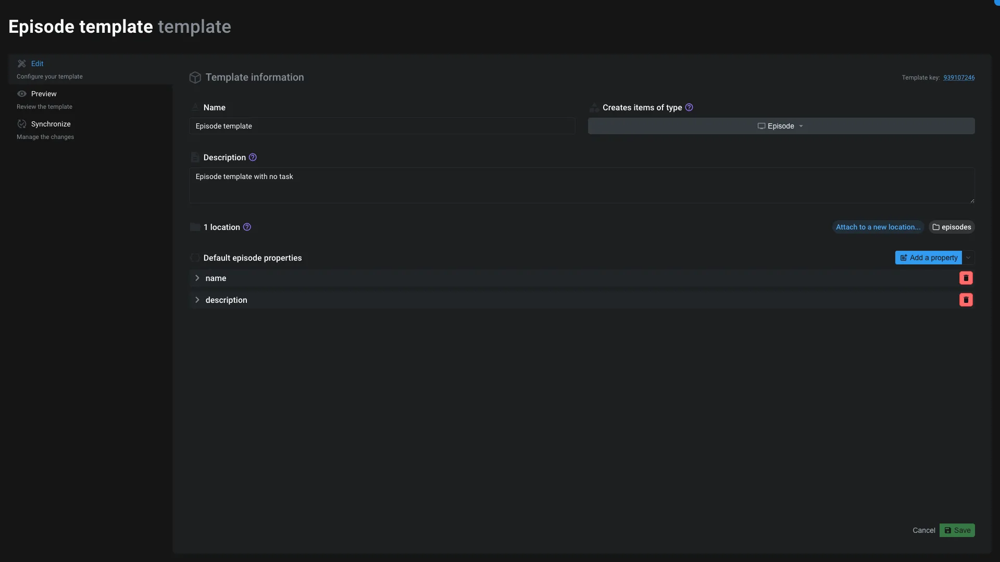

# Template editor

The template editor is the application dedicated to edit [templates](../items/template.md).

This application have different tabs on the left to manage the template:

## Information

You will find some general information about the template:

- **Name**: The name of the template
- **Template type**: The type of item the template will create
- **Template location**: The location of the template. Please refer the [Template item](../items/template.md#usage) for more information about it's usage. You can clone the template to multiple locations.
- **Description**: A description of the template

<$>[note]
A template can be only for a specific item's type.
<$>

## Form

On templates, you can define a form to fill when creating an item from the template. This tab allow you to define the form:

1. Click on the `Add field` button
2. Name your field
3. Edit the property model using basic meshQL syntax. Example: `item.data.name`, `item.data.custom_property`, ...
4. [Optional] Add a description to the field

By default Aquarium will use the [default form](./addmenu.md#form-creation) asking only for the name of the item.

Here is [an example of a form with multiple fields](../items/template.md):

<$>[warning]
At least one field need to be tight to the `item.data.name` property.
<$>

## Edit as...

This tab allow you to edit the template using the default application of the item type.

> Example: if the template is for a [Shot](../items/shot.md), the Edit as... application will be the [Shot editor](../applications/shoteditor.md).

## Edit content

This tab allow you to edit the content of the template using a very minalistic editor, where you can create, edit and delete items.

You can also use it to explore the actual content of the template.

## Nodal view

This tab display the template in a nodal view, where you can see the structure of the template, with all the items and their connections.

Today, the nodal view is read-only.

## Synchronize items

1. **Linked items** : This tab give you the list of all items that are dependent of the template.
   1. Click on the item to expand it and see the compare result. You can choose between a tree view or a nodal view.
   2. Use the icon launch to open the item in the default application.
   3. Use the icon link_off to unlink the item from the template.
2. **Link to an item**: Use this button to browse your project, select items and link them to the template. You can also unlink items using the link_off button next to each item.
3. **Compare options**: When you want to synchronise the items, you can choose several compare options:
   1. **Include/Exclude** items based on their type. You can filter the type of items you want to compare using this option. For example, on an episode, it makes sense to check only the tasks, since you can define default tasks on the episode template.
   2. By default, Aquarium will only compare if the item is present or not. Using the second option, you can **specify the properties you want to compare**.
   3. **Compare** button. When you click on this button, Aquarium will compare the items against the template and show you the differences. You can narrow down the items by selecting them in the list using the checkbox, or simply by clicking on the item itself to expand it.
4. **Sync**: This button will ask you to choose what's information you want to synchronize. You can choose to sync:
   1. The add **missing** items: those are the items that exist on the template but not on the linked items.
   2. The change_history **modified** items: those are the items where the selected properties doesn't match the template.
   3. The delete **exceeding** items: those are the items that exist on the linked items but not on the template. If you sync those items, they will be trashed.

<$>[error]
Use the sync with caution ! It's a powerful tool that can modify a lot of items at once. Preview the changes before applying them, by expanding some items in the list.
<$>