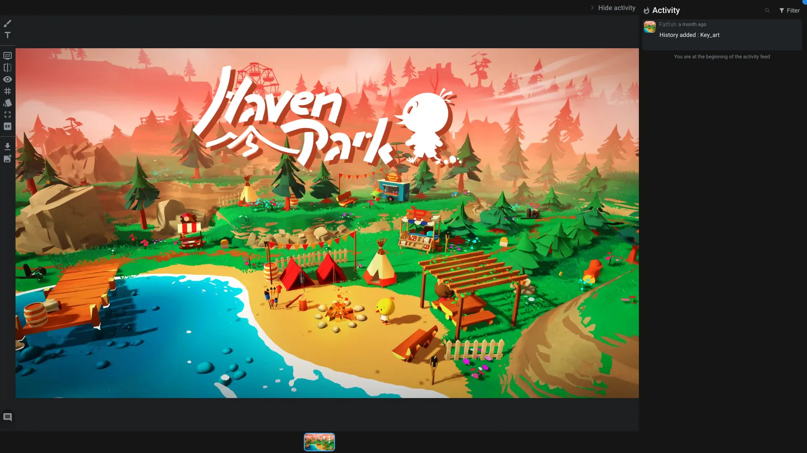

# Viewer

The viewer application is dedicated to open [Media item](../items/media.md).

> This application is embedded into several other applications like the [Playlist](./playlist.md), the [Shot editor](./shoteditor.md), the [Review workspace](../workspaces/review.md), ...

## Tools

On the left you can see all the tools to annotate or change the view of the media :

- **Draw**: Grab a pencil and draw on the media. Once this tool is selected, you can change the color, the opacity and the size of the pencil. You can also erase specific brushstroke.
  - If you are drawing on a video, you can change the timecode of the video to draw on specific frames and create animated drawings.
- **Text**: Add text on the media at a specific position.
- **Display options**: You can zoom and rotate the view
- **Flip**: Flip the view horizontally
- **Hide previous annotation**: Hide all the previous annotations, to have a clear view of the media.
- **Grid**: Display a grid on the media. You can change the type of the grid.
- **Compare**: Compare the media with another media.
  - You can change the type of the comparison (**Side by side**, **Swipe**, **Overlay** (on top of each other))
  - Sync compared video: this option will sync the timecode of the main video with the compared one.
  - Compare with medias: select the media you want to compare with. If you are in the [Shot editor](./shoteditor.md) or the [Asset editor](./asseteditor.md), you can load a media from another [task](../items/task.md) and/or [version](../items/version.md).
- **Fullscreen**: Go fullscreen
- **Download**: Download the media
- **Set as thumbnail**: You can set the current media as the thumbnail of the item.
- **Write a comment**: At the bottom, you have a button to add a comment on the media.
  - You can attach files to your comment.
  - You can record your screen with your microphone and add it as attachment to your comment. This allow you to go back in your software to explain something to your team.
  - You can also flag the comment as a [retake](../items/comment.md#retakes)
  - The comment is written in markdown, allowing you to insert images, checkboxes, ...
  - Using the `@` symbol, you can mention a user. The user will receive a notification if the associated [Action](../items/action.md) is enabled. Check our more in our [how-to create notifications](../../examples/tutorials/notifications.md).

If the viewer is opened with multiple media, there will be displayed in a carousel at the bottom of the viewer.

On the right you can open the activity panel to see all the previous comments on the media.

If the comment is associated to a video, by clicking on it you can move the video to the timecode of the comment. You can also define the duration of your comments using the handle under the video timeline.

## Shortcuts

- `D` : Draw
  - `ESC`: Disable draw tool
  - `E`: Erase
  - `ALT + mouse move`: Change the size of the brush (like in Photoshop)
  - `CTRL + Enter`: Send the draw and comment
- `T` : Text
  - `ESC`: Disable text tool
  - `CTRL + Enter`: Send the comment
- `Z`: Zoom to the actual size
- `F`: Zoom to fit
- `Space + mouse move`: Move the canvas (like in Photoshop)
- `R + mouse move`: Rotate the canvas (like in Photoshop)
- `CTRL + Enter`: Send the comment
- `Double click`: Reset the view

### Video shortcuts

- `Space` or `L`: Play/Pause
- `H`: Go to the beginning and play
- `Arrow left` or `J`: Go back 1 frame
- `Arrow right`: Go forward 1 frame
- `I`: Set the in point
- `O`: Set the out point