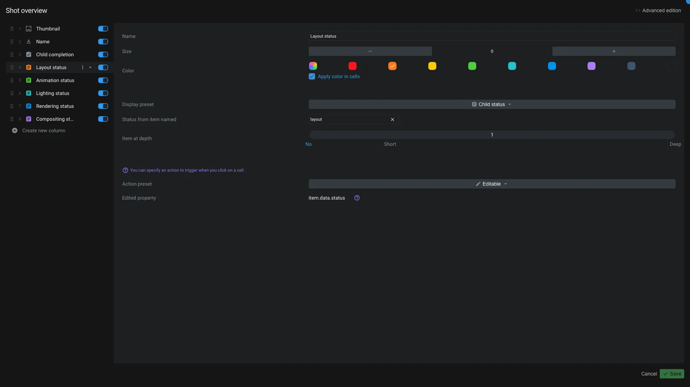

# Views

The views application is used to manage [view item](../items/view.md). A view is used in [workspaces](./workspaces.md) to regroup columns together.



On the top of the interface you can change the name of a view.

## Edit a column

The left panel displays the list of the columns in the view. You can drag and drop a column to change its position.

At the bottom of that list you have a button to add a new column.

On each column you can hide/unhide it by clicking toggling the switch. In the <span class="aq-icon">more_vert</span> menu next to the name of the column, you can duplicate or delete it.

Once a column is selected, you can edit its properties on the right panel:

- **Name**: Name of the column
- **Size**: Width of the column
- **Label color**: Color of the column
  - **Apply label color in cells**: Apply the label color in the cells

Under this section, you have dedicated preset and preset's options.

- **Preset**: Preset configuration for the column. We provide a bunch of presets, based on the data that we handle by default. You can also [create your own columns](../../how-to/create/column.md).

On a preset is selected, you can edit its options just under. The options depends on the preset selected.

<$>[note]
Feel free to [contact us](../../contact.md) if you think a preset or an option is missing.
<$>

Under the preset's options, you can choose the behavior of the click on the column:

- **None**: Nothing happens when you click on the column
- **Editable**: Will allow you to edit the content of the column. Like changing the name of the item, changing the status, etc.
- **Open current item**: Will open the line item in the default application.
  - Each application can have parameters passed to it. You can set them in the `App parameters` section. If you want its parameters to be resolved dynamically, you can check the `Send app parameters as meshQL` checkbox.
- **Browse current item**: Will navigate into the line item.
- **Open app**: Allow you to open the line item or the cell item with a specific application.
  - You can also use app parameters and send them as meshQL.

On top of the application, you have a button `Advanced edition` to see the JSON data of the view.

<$>[info]
There is a special preset called `advanced`. It allows you to edit the column as code, without loosing your changes.

So, if you use the `advanced edition` button, do not modify the columns that are not using the `advanced` preset. You will loose your changes.
<$>

## Advanced edition

You can view and edit column's code. You can use that to create you own columns.

A column is defined by the following properties:

```javascript
{
  "preset": "childStatus", // Preset id used by the column
  "name": "Layout status", // Name of the column
  "type": "status", // Type of the column
  "model": "item.data.status", // The property where to save the edited value. Used only if the column is editable
  "width": "150px", // Width of the column
  "set": { // SET variable for the column using meshQL.
    "setlayoutstatusu66f17f97": "FIRST(# -($Child,1)> item.data.name == 'layout' VIEW item)"
  },
  "data": { // Data configuration for the column using meshQL
    "itemKeys": "setlayoutstatusu66f17f97._key", // Item _keys of the content of the cell. It's used to know on which entity the model need to be saved.
    "value": "setlayoutstatusu66f17f97.data.status", // The actual value displayed in the cell
    "color": "setlayoutstatusu66f17f97.data.color" // Some columns type can have a color
  },
  "id": "u66f17f97", // Each column need to have a unique id. The id need in the current view. By default Aquarium take care of it by checking if no other columns have the same id.
  "labelColor": "#fd7b1f", // The color of the label
  "applyLabelColorInCells": true // Apply the label color in the cells
}
```

Feel free to check the code on existing column to have more example on how it works. Some preset have other properties available.

When you create a custom column, you mainly need to provide a `type` and the `data` object with a value. If you want the column to be editable, you need to provide a `model` property.

### Columns types

When you create a custom column, you can choose between different types:

| Type | ID | Description |
| :--- | :---- | :----------- |
| Text | `text` | Used to display one line of text |
| Textarea | `textarea` | Allow to display multiple lines of text with markdown |
| Number | `number` | Used to display a number |
| Checkbox | `checkbox` | Used to display a checkbox |
| Date | `date` | Used allow to display a date |
| Duration | `duration` | Used to display a duration |
| Timecode | `timecode` | Used to display a timecode |
| Image | `image` | Used to display an image |
| Tags | `chips` | Used to display tags |
| Url | `url` | Used to display an url |
| List | `list` | Used to display a list |
| Badge | `badge` | Used to display a badge |
| Button | `button` | Used to display a button |

<$>[note]
If you think a type is missing, feel free to [contact us](../../contact.md).
<$>
