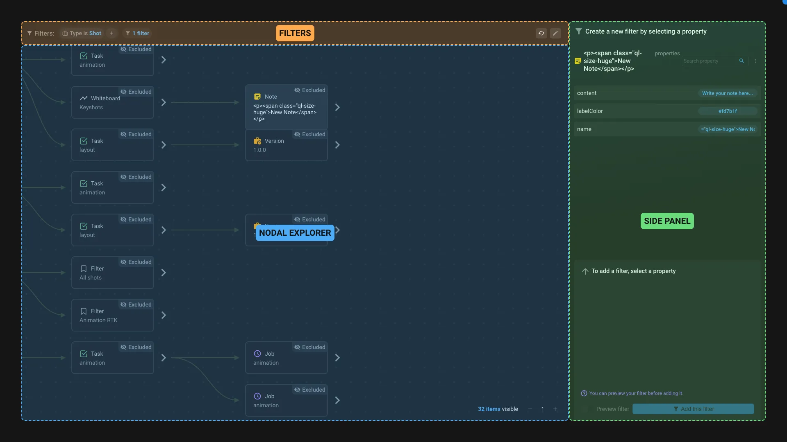

# Workspace nodal editor

This application is used to create and edit existing workspace filters using a nodal interface.

The goal of this application is to make it easier to create complex filters, using existing item's properties and relations.

The interface is divided in 3 parts:

- The **filters** show the existing filters of the workspace. You can add, edit or remove them. Just right click on a filter to disable it.
- The **nodal explorer** allow you to browse your hierarchy of items. Double click on an item or on the chevron_right to expand it.
- Once an item is selected, you can see its properties in the **side panel**. Select a property to create its filter. You can preview the filter by toggling the `Preview filter` option. If you are happy with it click on `Add this filter` button.

## How to create a new filter

1. Browse your hierarchy to find the relevant item. Expand items to see their content and find relevant items.
2. Select the item you want to use as a filter.
3. Select the property you want to filter on.
4. Click on the `Add this filter` button.

> For example, if your workspace display the shots of a project and you want to show only shots where the task > animation has its status set to `Done`, you can do the following:
>
> 1. Expand a shot item.
> 2. Select the animation Task.
> 3. Select the status property.
> 4. Click on the `Add this filter` button.

> [!info]
> If you are not able to see any items check the `depth` filter parameter and other filters to see if they are not hiding the items you are looking for.