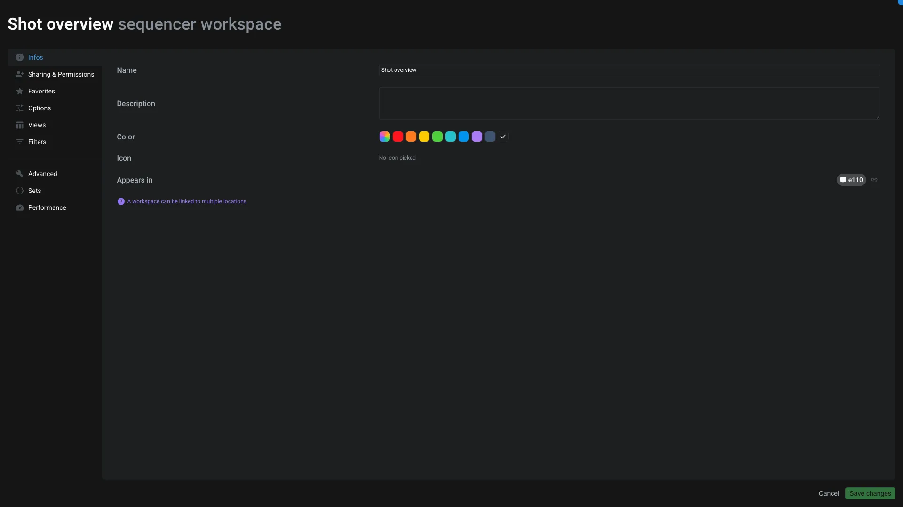

# Workspaces

This application is used to edit the [Workspace item](../items/workspace.md).

Workspaces are an **important notion** in Aquarium. Find more information about them in [the dedicated section](../workspaces/index.md).

## Infos

In the tab, you can see and edit the following information:

- The **name** of the workspace
- The **description** of the workspace
- The **color** of the workspace
- The **icon** of the workspace
- The **location** of the workspace. A workspace can be instantiated (clone) in multiple locations to avoid duplicating the same workspace.

## Sharing & permissions

Like [on any other items](../items/index.md#permissions), you can define the permissions of the workspace. You can remove participant to hide the workspace from them. And you can also restrict their permissions to read-only, to avoid them being able to edit the workspace (like creating, moving or deleting columns, changing filters, ...).

> [!warning]
> Those permissions are only for the workspace itself (filters, column, ...). The content of a table, like the status of a task, is managed on the task itself.

## Favorites

You can add a workspace as a favorite to access it quickly from the [Focus interface](../introduction/focus.md).

You can also add as favorite for other users, so they don't have to do it themselves.

## Options

This is where you can edit some options of the workspace:

- **Display**: some workspaces are compatible with multiple display like `card`, `table`, ...
- **Sort**: you can define the default sort of the workspace
- **Groups**: you can define the default groups of the workspace. A group is a way to regroup items together, like based on their parent (ex: shots in a sequence), or based on their status, ...

More details about those options can be found in the [dedicated section](../workspaces/index.md#options).

## Views

A [View](../items/view.md) is used in workspaces to regroup columns together.

From this interface you can define the height of the lines of your table and enable/disable the default view.

You can also create a new view or edit an existing one. To edit a view click on the edit icon. It will open the [view editor](./views.md).

> [!note]
> You can create multiple view to regroup columns together. Since a view is an item, you can clone views into other workspaces.

## Filters

All options related to filters are available here :

- **Search**: you can search for a specific keyword
- **Depth**: you can define the search depth. More details about this concept can be found in the [dedicated section](../workspaces/index.md#depth).
- **Quick filters**: you can edit the quick filters. Quick filters are filters easily accessible from the workspace interface.
- **Default filter**: you can enable/disable the default filter. Most of the time this filter is used to hide hidden elements. You can disable this filter to unhide items.
- **Saved filters**: are predefined filters that you can enable/disable in one click.

## Advanced

From here you can access the advanced options of the workspace:

- **Quickeditor**: open the workspace in the [quickeditor](./quickeditor.md)
- **Editor**: open the workspace in the [JSON editor](./texteditor.md)
- **Export**: export the workspace in a JSON file. It's useful if you need to share a workspace with Aquarium support. Please note the export doesn't include the content of the table, only the workspace configuration.
- **Creatable items**: you can restrict the type of items available in the `Create` button.
- **Edge type**: by default Aquarium display items using `Child` edge. In very specific cases you might want to display items using another edge type. This option is here for this purpose.
- **Direction**: Aquarium is a nodal solution using a graph to structure your data. The graph that we use have a direction. By default, when you browse folders, you go from the parent to the children: you are going down. But in some cases you might want to go up. This option is here for this purpose. You can also use the `both` direction to go up and down at the same time.

## Sets

This tab is here to edit the sets of the workspace.

A [SET is used in meshQL](../../api/meshql.md#set) to store a query result and reuse it in other queries. Most of the time it's a feature used by technical users to optimize workspace loading time.

A set can be used in a column, filter, group, ...

You can define multiple sets in a workspace. Each set has a name and a query. The query is a meshQL query that will be executed when the workspace is loaded. The name is important since it's how you can reference the set in other queries.