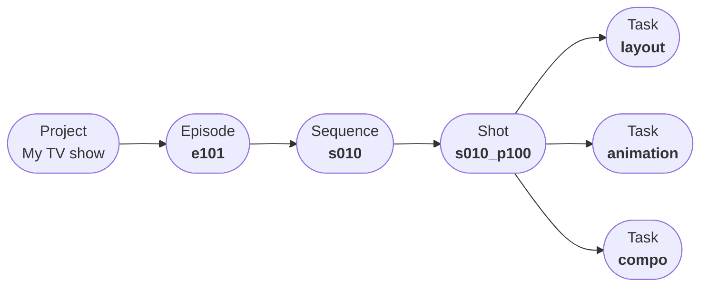

<$>[note]
Don't know where to start ? Follow our [quick start guides](/web/quickstart).
<$>

# How Aquarium works ?

Aquarium works like your computer.

| On your computer | On Aquarium |
|:--------|:-------|
| You have folder to store your files | You have folders to store your [items](/web/items) |
| You open your files with applications | You open your items with [applications](/web/applications) |
| You explore your folders with a file explorer | You explore your folders with a [workspace](/web/workspaces) |

There are some differences. On Aquarium :

- Their is not only one explorer to navigate into your folders. We created several workspaces, to fit specific project management needs. You can[ discover them in our dedicated section](/web/workspaces).
- It's a nodal solution. Meaning that you can create connections, called [edge](/web/edges), between your items. This feature bring a lots of flexibility to create the project you want. It's also a way to create relations between your items, like a parent/child relation between a [Shot](/web/items/shot) and a [Task](/web/items/task), to assign a [Task](/web/items/task) to a [User](/web/items/user), etc.

# How can I use Aquarium ?

When you work with people, not everyone has the same needs. Some people need to [focus on their work](/web/interfaces/focus), others need to [manage their projects](/web/interfaces/studio), and some [need to review the work](/web/interfaces/rooms).

That's why Aquarium offer 3 different interfaces :

| [Focus](/web/interfaces/focus) | [Studio](/web/interfaces/studio) | [Rooms](/web/interfaces/rooms) |
|:--------:|:-------:|:-------:|
|  |  |  |
| [Focus](/web/interfaces/focus), is the easy interface. It's a unique experience, where you can focus on your work. Users also have access to their diary, with all their tasks and timelogs. | [Studio](/web/interfaces/studio) is the complete interface. It's working like on your computer, where you can create folders and choose how to display its content by creating workspaces. | [Rooms](/web/interfaces/rooms) is the interface dedicated for external reviews. No need to give them access to the full project, only share some playlists and read-only workspaces. |

<$>[info]
As a user, you can choose the interface you want to use. You can switch between them at any time. And you can set the default one from your [profile preferences](/web/applications/profile).
<$>