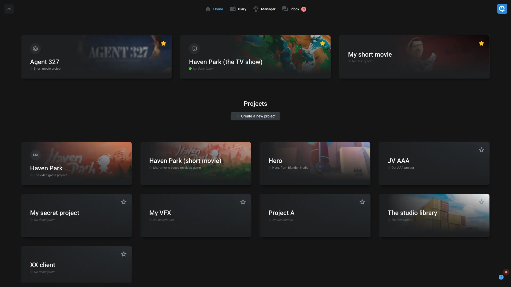
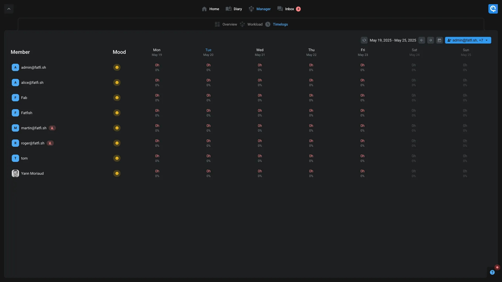

# Focus interface

This focus interface offer an easy way to discover and use Aquarium. It's also a dedicated interface for people who need to focus on their work with the [Diary](#diary) feature.

On top of the screen, you can select 4 different pages :

- [Focus interface](#focus-interface)
  - [Home](#home)
  - [Diary](#diary)
  - [Manager](#manager)
  - [Inbox](#inbox)

## Home

The home page is the main page where you can see all your projects. You can also create a new project by clicking on the "Create a new project" button. Check out our how-to [create a project](../quickstart/manager.md) guide.

When you click on a project, you will have more information about it.

1. **Favorite workspaces**: In this sidebar, you can see your favorite workspaces. You can add a workspace as favorite by clicking on it and then on the star icon, or from the [workspace settings](../applications/workspaces.md#favorites). As a manager you can add a workspace as favorite for users.
2. **Other workspace**: All other workspace from the same type are available here. You can click on a workspace to open it. It wont be added to your favorites automatically.
  1. **Create another workspace**: You can create a new workspace of same type from the menu.
3. **Project settings**: Open the [project settings](../applications/projectsettings.md) of the project.

If you go back to the root project page using the breadcrumb, you can see all the modules available in the project.:

Each type is dedicated for a specific needs (ex: shots manager, wiki, ...). You can have the full [list of all available workspaces](../workspaces/index.md) in the dedicated documentation.

1. **Favorite workspaces**: Your favorite workspaces are always accessible from here.
2. **Enable a new module**: If you want to add a new module, you can click on the last one. Even if a module is already enabled, you can reuse it to create a new workspace with the same type.

## Diary

The diary page is an interface where a user can see its tasks and timelogs.

1. **Tasks**: On the left tasks of the artist are displayed. Use the filter on top of the list to narrow down the displayed tasks.
2. **Agenda**: On the right, the agenda is displayed. Use the arrow on the top to navigate between days. If you click on the date, you can jump to a specific day and change the display mode (day, week).

Drag-n-drop a task to a day to create a timelog. You can also, like in Google Agenda, dragging in an empty hour to create a timelog.

If a task is already assigned to you, you can check the box "I worked" to create a timelog.

Grab the end of a timelog to change its duration.

## Manager

This page is very useful for having access to information accross all your projects and for a specific team. We currently have 2 main sections :

- **Timelogs**: This give you an overview of all the timelogs of the team for a given week. It's perfect to see if the team is working on the right tasks and if all the timelogs are correctly filled. You can also see the total time worked for each user.
- **Workload**: When working on multiple projects, it's important to know if someone is available to work on a new task and not overloaded. This page give you an overview of the workload of the team for a given week. You can see the total time worked for each user and the total time available. When you click on a day, you can see the details of the tasks assigned to the user.

## Inbox

The inbox is a dedicated interface to see all your notifications.

