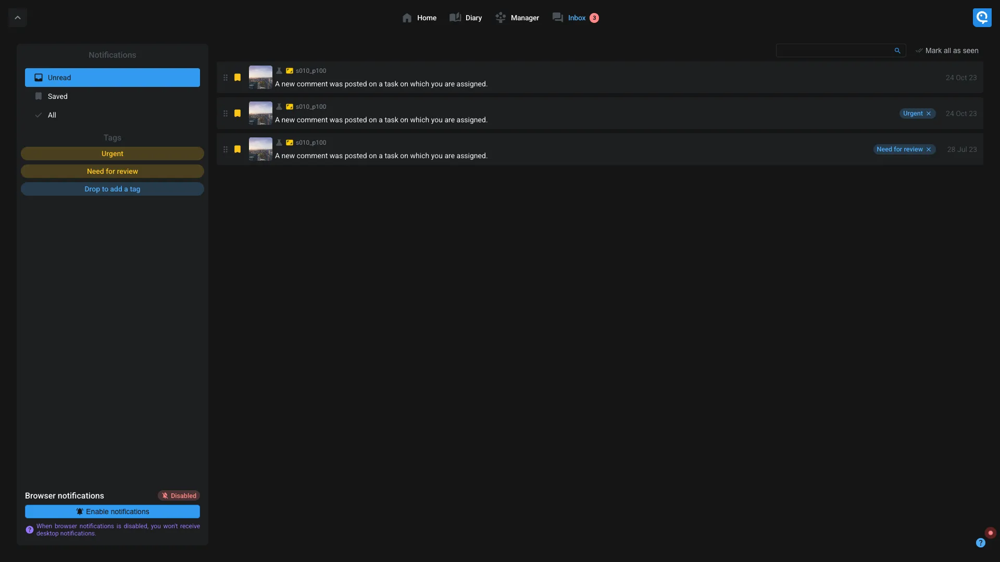

# Focus interface

This focus interface offer an easy way to discover and use Aquarium. It's also a dedicated interface for people who need to focus on their work with the [Diary](#diary) feature.

On top of the screen, you can select 3 different pages :

- [Focus interface](#focus-interface)
  - [Home](#home)
  - [Diary](#diary)
  - [Inbox](#inbox)

## Home

The home page is the main page where you can see all your projects. You can also create a new project by clicking on the "Create a new project" button. Check out our how-to [create a project](../../how-to/create/project.md) guide.

When you click on a project, you will have more information about it.

1. **Favorite workspaces**: At the top of the interface, you can see your favorite workspaces. You can add a workspace as favorite by clicking on it and then on the star icon, or from the [workspace settings](../applications/workspaces.md#favorites).
2. **Other workspace**: We regrouped the workspaces based on their type. Each type is dedicated for a specific needs (ex: shots manager, wiki, ...). You can have the full [list of all available workspaces](../workspaces/index.md) in the dedicated documentation.
3. **Project settings**: Open the [project settings](../applications/projectsettings.md) of the project.

Once you click on a workspace type, you have the list of all workspace available :

1. **Workspaces list**: All the workspaces of the selected type are displayed. You can click on a workspace to open it.
2. **Add as favorite**: You can add a workspace as favorite by clicking on the star icon. If the workspace is already a favorite, you can remove it by clicking on the star icon.
3. **Create another workspace**: You can create a new workspace of the selected type by clicking on the add icon.

Once you clicked on a workspace, you can see its content :

## Diary

The diary page is an interface where a user can see its tasks and timelogs.

1. **Tasks**: On the left tasks of the artist are displayed. Use the filter on top of the list to narrow down the displayed tasks.
2. **Agenda**: On the right, the agenda is displayed. Use the arrow on the top to navigate between days. If you click on the date, you can jump to a specific day and change the display mode (day, week).

Drag-n-drop a task to a day to create a timelog. You can also, like in Google Agenda, dragging in an empty hour to create a timelog.

If a task is already assigned to you, you can check the box "I worked" to create a timelog.

Grab the end of a timelog to change its duration.

## Inbox

The inbox is a dedicated interface to manage the conversation where you are involved.

In a near future, you will be able to see your notifications too.

