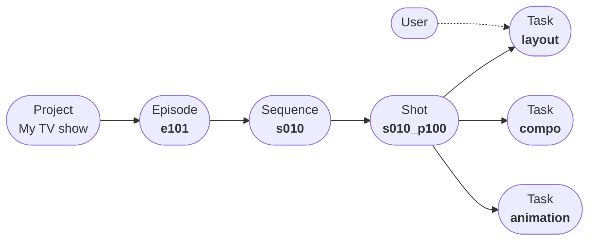

>[!NOTE]
>Don't know where to start ? Follow our [quick start guides](../quickstart/manager.md).

# How Aquarium works ?

Aquarium works like your computer.

| On your computer | On Aquarium |
|:--------|:-------|
| You have folder to store your files | You have folders to store your [items](../items/index.md) |
| You open your files with applications | You open your items with [applications](../applications/index.md) |
| You explore your folders with a file explorer | You explore your folders with a [workspace](../workspaces/index.md) |

There are some differences. On Aquarium :

- There is not only one explorer to navigate into your folders. We created several workspaces, to fit specific project management needs. You can[ discover them in our dedicated section](../workspaces/index.md).
- It's a nodal solution. Meaning that you can create connections, called [edge](../), between your items. This feature bring a lots of flexibility to create the project you want. It's also a way to create relations between your items, like a parent/child relation between a [Shot](../items/shot.md) and a [Task](../items/task.md), to assign a [Task](../items/task.md) to a [User](../items/user.md), etc.

# How can I use Aquarium ?

When you work with people, not everyone has the same needs. Some people need to [focus on their work](./focus), others need to [manage their projects](./studio), and some [need to review medias](./rooms).

That's why Aquarium offer 3 different interfaces :

| [Focus](./focus) | [Studio](./studio) | [Rooms](./rooms) |
|:--------:|:-------:|:-------:|
|  |  |  |
| [Focus](./focus), is the easy interface. It's a unique experience, where you can focus on your work. Users also have access to their diary, with all their tasks and timelogs. | [Studio](./studio) is the complete interface. It's working like on your computer, where you can create folders and choose how to display its content by creating workspaces. | [Rooms](./rooms) is the interface dedicated for external reviews. No need to give them access to the full project, only share some playlists and read-only workspaces. |

>[!info]
> As a user, you can choose the interface you want to use. You can switch between them at any time. And you can set the default one from your [profile preferences](../applications/profile.md).
>
> As an administrator, you can set the default interface for users from the [domain application](../applications/domain.md).

# How Aquarium is structured ?

There are 3 main concepts in Aquarium :

- [Items](../items/index.md) : Items are the building blocks of your projects.
- [Applications](../applications/index.md) : You open your items with Applications, like you open files with applications on your computer.
- [Workspaces](../workspaces/index.md) : You search and browse your items with Workspaces. Some workspaces allow you to create columns to customize the interface and interact with items data (like changing a status, display a thumbnail, ...).

# How can I find help from Aquarium ?

Like the old school software, press `F1` to open the help panel. You can also click on the help icon to open it.

In the help panel, you will find this documentation, and quests to guide you through the interface and learn how to use Aquarium.