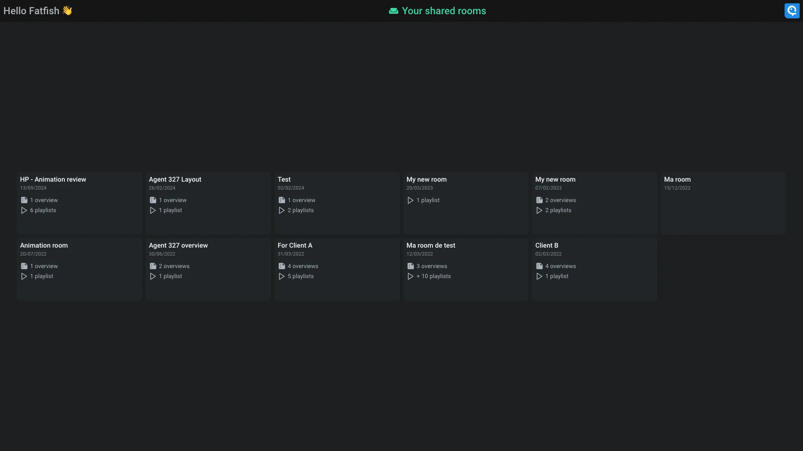
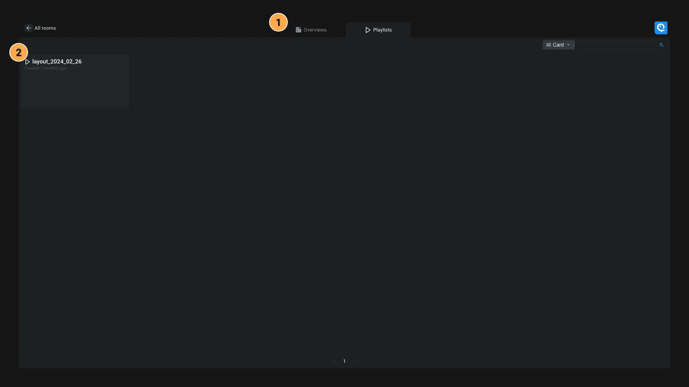
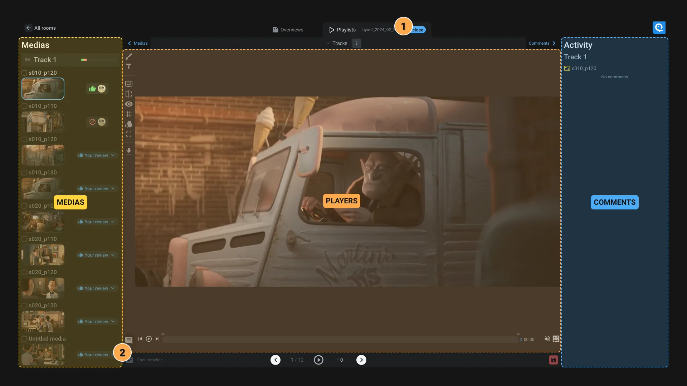

# Rooms interface

The rooms interface is the interface for external reviews. It's a simple interface that allows you to see all playlists and overviews that are shared with you.

> [!info]
> An account is required to access to this interface. This allows us to display the name of the person who comments, secure the access to the medias and check user permissions.

Playlist and workspaces are regrouped into [room](../items/room.md). You can crate a room for a department or directly for a project. Use them as you want.

Once you selected a room, you can see all the playlists and workspaces that they contain.

1. **Displays**: Switch between *Playlist* or *Overviews*. This menu might be different depending on the room configuration.
2. **Playlist**: List of all the playlists in the room.

Once you clicked on a playlist, you can see all the medias and comments.

- **Medias**: All the medias of the playlist. You can click on a media to display it in the player. You can also indicate if you approve or not the media during your review.
- **Comments**: The comments of the active media. You can add a new comment from the player using the brush icon or by writing in the comment box comment.
- **Players**: The active player display the active media

