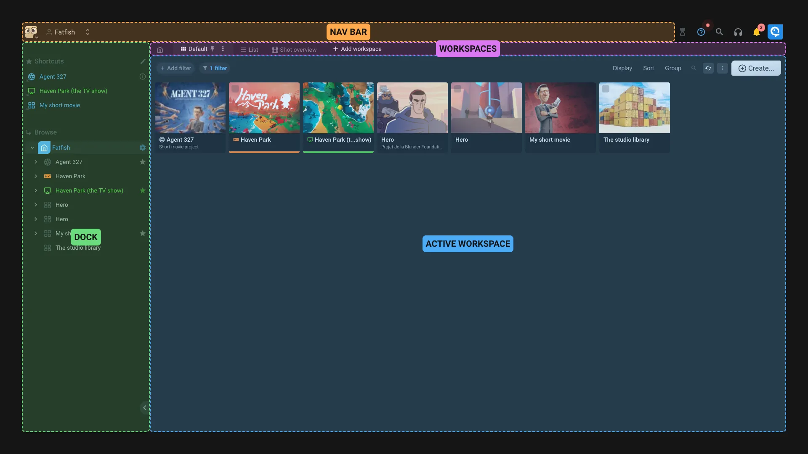

# Studio interface

The studio interface is the most complete interface of Aquarium. This main difference with the [Focus interface](./focus.md) is that you need to navigate in your project, before selecting or creating a workspace.

## Interface layout

- **Nav bar**: This is the main navigation bar. You can select a project, an organization, or your user. The breadcrumb is also displayed. You always now where you are.
- **Dock**: This is the dock. You can open/close it by clicking on the arrow. It's working like on a Mac or Windows : On the top you can see the project shortcuts, and on the bottom you have a browser to navigate in the project. The shortcuts are the same for all users of the project.
- **Workspaces**: The workspaces are displayed like tabs. You can click on a workspace to open it. You can also create a new workspace by clicking on the `Add workspace` button. The first workspace is always the default one, that will be active by default when you open the location where you are.
- **Active workspace**: Once you selected a workspace, it's displayed in the main area. More details about [the workspace interface in the dedicated documentation](../workspaces/index.md#options).

For the power user, or the one that love keyboards, you can launch the command palette by pressing `CTRL+/` or `CMD+/` on Mac. You can also trigger it by clicking on the search icon on top right of the screen.

## What's a workspace ?

Let's start with something everyone knows : on a computer, when you browse your files, you use the Explorer (Windows) or Finder (Mac). It's like having one interface to display the content of your computer : you can change the view (icon, list, ...), search for files, create new files, ...

In Aquarium, you can see a workspace like the Explorer or Finder. It's here to display the content of a specific folder.

The difference is that in Aquarium, you can create as many workspace as you want ! Its so cool because you can create different workspaces based on your needs : show the shots of a project with status columns, show the sequences with a summary of the completion of your shots, show all the media of a project, ...

The other difference is that you can choose the depth of the display. Meaning that you can display items that are stored in subitems.

We also created different types of workspace, to respond to specific project needs : shots manager, wiki, media manager, ... You can check the full list of [available workspaces in the dedicated documentation](../workspaces/index.md#workspace-types).