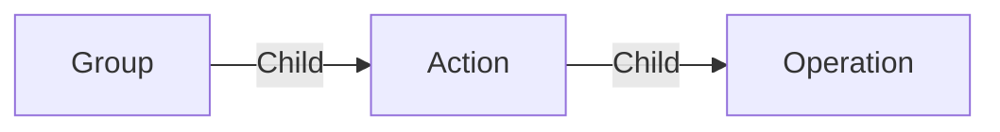

# Action

An **science Action** is here to automate things directly from the interface using nodal.

Action can be re-grouped in a Group to be easily re-used in other actions.

An action can be edited from the [action editor](../applications/actioneditor.md).

## Data

| Key | Type | Description |
| :--- | :---- | :----------- |
| `name` | `string` | Name of the action |
| `description` | `string` | Description of the action |
| `eventName` | `string` | Event name to trigger the action |
| `inputs` | `array` | List of input fields |
| `outputs` | `array` | List of output fields |
| `locations` | `array` | List of locations where the action can be triggered |

## Structure

