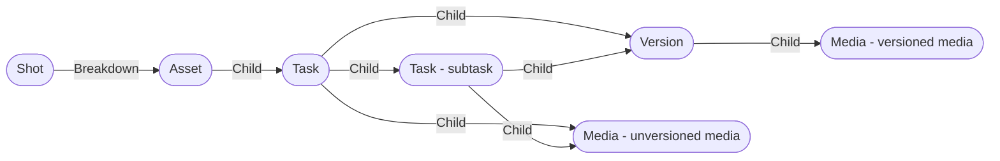

# Asset

An **work Asset** is composed by tasks where you can upload medias.

Tasks can have sub-tasks too.

Medias can be regrouped into versions.

The application used by default is [Asset editor](../applications/asseteditor.md).

## Structure

