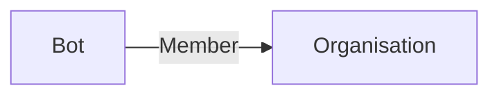

# Bot

A **smart_toy Bot** is a virtual user that can interact with the API. A bot can't access to the web interface.

A bot is used to authenticate and interact with the API like in a script, a pipeline, ...

Bot can be created and managed from the [domain](../applications/domain.md#bots) section.

> [!info]
> Since bot acts like a user, you need to invite them to your projects or any item you want it to interact with.

## Structure

