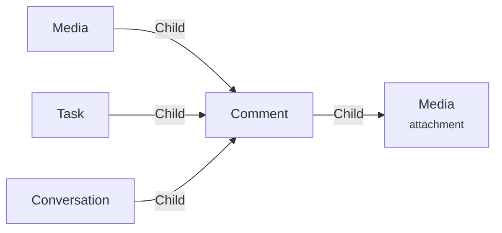

# Comment

A **comment Comment** represents a comment on an item, like an a media, a task, ...

There is no dedicated editor for comments. Most of the time comments are editable directly from its parent item : like the [conversation](../applications/blah.md), [viewer](../applications/viewer.md) for a media, the [task editor](../applications/tasks.md) for a task, ...

A comment can have media attached to it.

You can write a comment using markdown.

## Data

| Key | Type | Description |
| :--- | :---- | :----------- |
| `content` | `string` | Content of the comment |
| `type` | `string` | Type of the comment |
| `frameIn` | `number` | Frame in of the comment |
| `frameOut` | `number` | Frame out of the comment |
| `draws` | `array` | Array of draw object |

### Draw object

| Key | Type | Description |
| :--- | :---- | :----------- |
| `path` | `string` | SVG path of the draw |
| `color` | `string` | Color of the draw |
| `opacity` | `number` | Opacity of the draw |
| `thickness` | `number` | Thickness of the draw |
| `timestamp` | `number` | Timestamp of the draw. Used for animated draws. |

## Structure

