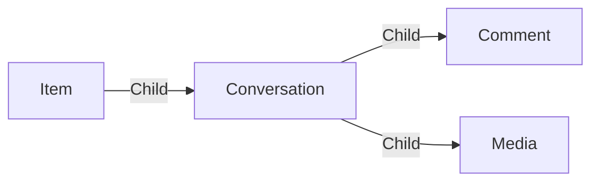

# Conversation

A **forum Conversation** is a discussion between users. You can see a conversation as a thread of messages like in Slack, Discord, ...

You can upload media in a conversation to share images, videos, ...

## Data

| Key | Type | Description |
| :--- | :---- | :----------- |
| `name` | `string` | Name of the conversation |
| `description` | `string` | Description of the conversation |
| `status` | `string` | Status of the conversation (`open`, `closed`, ...) |
| `tags` | `array` | List of tags |

## Structure

