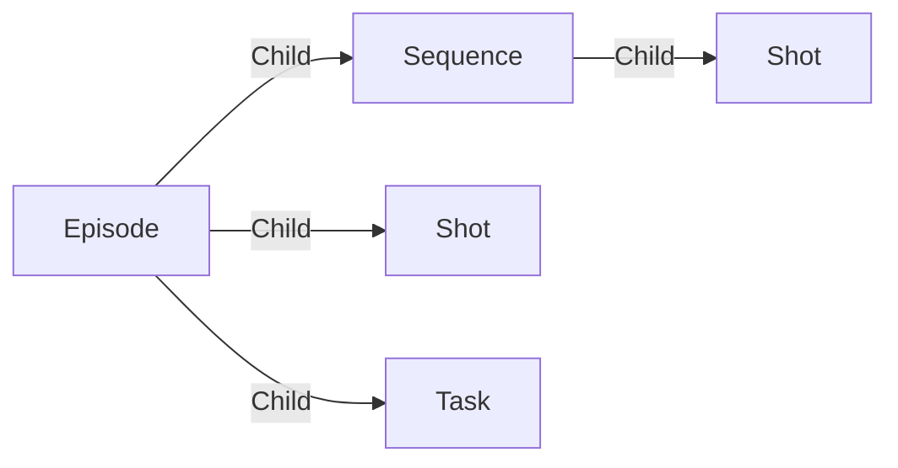

# Episode

An **tv Episode** is here to regroup [sequences](./sequence.md) and [shots](./shot.md) like on a TV show.

You can also create tasks on episodes to track and manage global tasks per episodes.

## Data

| Key | Type | Description |
| :--- | :---- | :----------- |
| `name` | `string` | Name of the episode |
| `description` | `string` | Description of the episode |

## Structure

