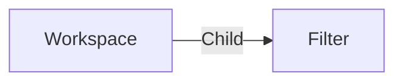

# Filter

A **filter Filter** is used in [workspaces](./workspace.md) to save filter and re-use them later.

A filter can be edited from the [workspace editor](../applications/workspaces.md) or with the [filter editor](../applications/filters.md).

## Data

| Key | Type | Description |
| :--- | :---- | :----------- |
| `name` | `string` | Name of the filter |
| `description` | `string` | Description of the filter |
| `filters` | `array` | List of filters options used to build the interface |
| `filter` | `string` | Filter query dynamically created based in `filters` property |
| `aliases` | `object` | List of aliases used in the query |

## Structure

