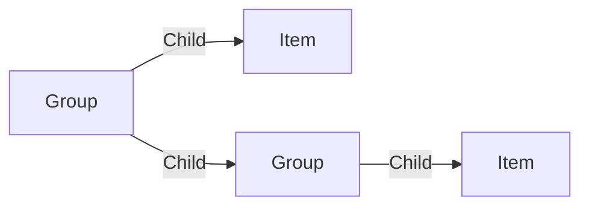

# Group

A **folder Group** is a folder. You can use a folder like an a computer folder to store and organize your items.

A group can have subgroups and items.

## Data

| Key | Type | Description |
| :--- | :---- | :----------- |
| `name` | `string` | Name of the group |

## Structure

