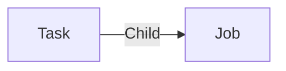

# Job

A **access_time Job** is a timelog. A job can be created on any item to log time spent on it. Most of the time, a job is created in a task.

A job can have a mood to evaluate the satisfaction of the user who performed the job.

A job can be edited with the [Timelogs](../applications/timelogs.md) application.

## Data

| Key | Type | Description |
| :--- | :---- | :----------- |
| `performedAt` | `datetime` | Start date of the job |
| `duration` | `duration` | Duration of the job |
| `performedBy` | `string` (`user._key`) | User key who performed the job |
| `comment` | `string` | Description or comment of the job |
| `mood` | `number` | Mood of the job. `-1`: dissatisfied, `0`: neutral, `1`: satisfied |

## Structure

