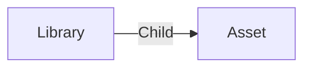

# Library

A **business_center Library** is a collection of assets. It's used to regroup similar asset like characters, props, environments, ...

## Data

| Key | Type | Description |
| :--- | :---- | :----------- |
| `name` | `string` | Name of the library |
| `description` | `string` | Description of the library |

## Structure

