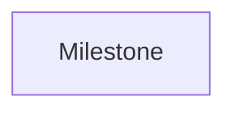

# Milestone

A **event_upcoming Milestone** is a key event in a project. It can be a deadline, a key delivery, a meeting, ...

## Data

| Key | Type | Description |
| :--- | :---- | :----------- |
| `name` | `string` | Name of the milestone |
| `description` | `string` | Description of the milestone |
| `deadline` | `string` | Date of the milestone |
| `labelColor` | `string` | Color of the milestone |

## Structure

