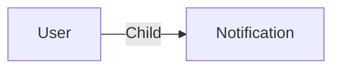

# Notification

A **notifications_none Notification** is an item used to store the notification details sent to a user.

You can automatically send notifications to users or usergroups using the [Action](./action.md) system.

You can see all your notifications using the [notification center](../applications/notify.md).

## Data

| Key | Type | Description |
| :--- | :---- | :----------- |
| `content` | `string` | Content of the notification |
| `notifiedBy` | `string` | Action _key which sent the notification |
| `seen` | `boolean` | If the notification has been seen by the user |
| `tags` | `array` | Array of tags |

## Structure

