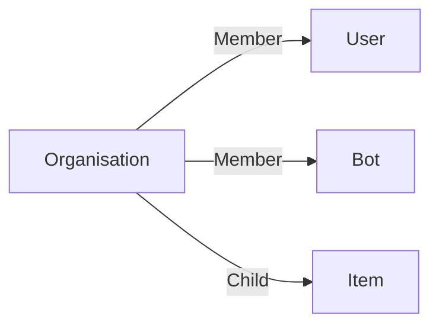

# Organisation

An **business Organisation** is here to regroup users together and allow them to see each others and to centralize their work.

You can use an organisation has a global folder to organise and store your projects, global tasks, ...

## Data

| Key | Type | Description |
| :--- | :---- | :----------- |
| `name` | `string` | Name of the organisation |

## Structure

