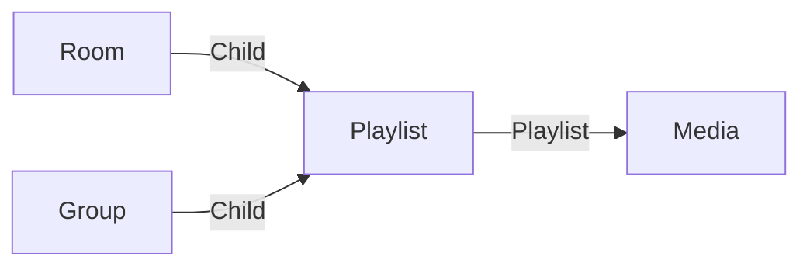

# Playlist

A **play_arrow Playlist** is a here to regroup media, that need to be reviewed or seen the one after the other together.

You can open a playlist with the [Playlist application](../applications/playlist.md).

A playlist can be stored in a [Room](./room.md) for sharing it to external users.

## Data

| Key | Type | Description |
| :--- | :---- | :----------- |
| `name` | `string` | Name of the playlist |
| `description` | `string` | Description of the playlist |

## Structure

