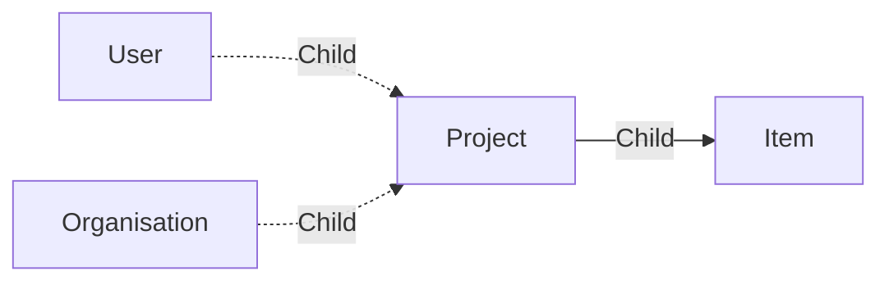

# Project

A **widgets Project** is a here to represent a project.

Most of the time projects are stored in Organisation. A project can be stored in a User too.

Aquarium allow you to create projects inside projects.

The application used by default to edit its settings is [Project settings application](../applications/projectsettings.md).

## Data

| Key | Type | Description |
| :--- | :---- | :----------- |
| `name` | `string` | Name of the project |
| `description` | `string` | Description of the project |
| `thumbnail` | `string` | Thumbnail of the project |
| `startdate` | `date` | Start date of the project |
| `deadline` | `date` | Deadline of the project |
| `type` | `string` | Type of the project (`episodic`, `movie`, ...) |
| `labelColor` | `string` | Color of the project |
| `completion` | `number` | Completion of the project. Used to indicated if a project is archived by setting it's value to '-1' |

## Structure

