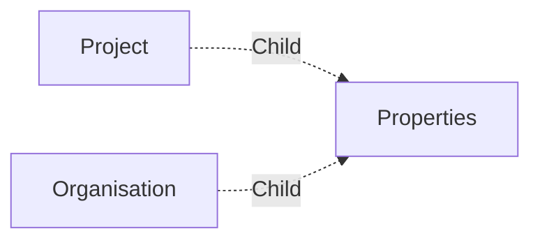

# Properties

A **instant_mix Properties** is a here to store properties.

This item is used to handle [Project's properties](../applications/projectsettings.md#properties) and [Organisation's properties](../applications/organisation.md#properties). Some connectors use it to store their settings too.

But you can use those items to store your custom or pipeline settings too.

## Data

| Key | Type | Description |
| :--- | :---- | :----------- |
| `name` | `string` | Name of the property |

All the rest of the data is used to store the properties.

## Structure

